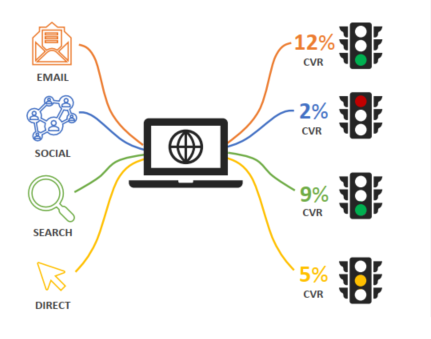
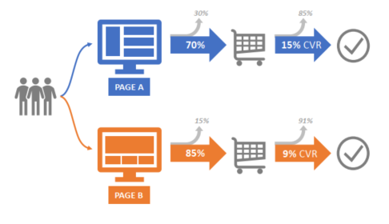
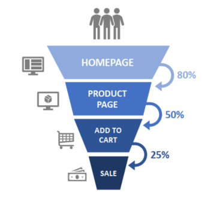
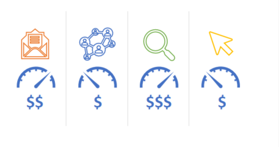
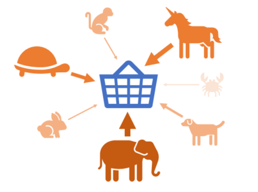
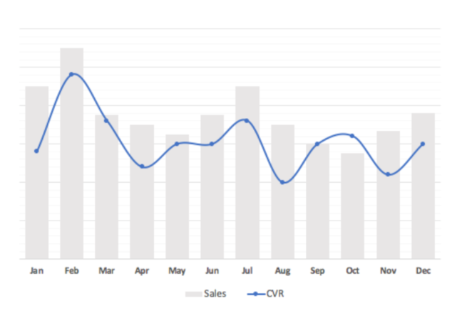
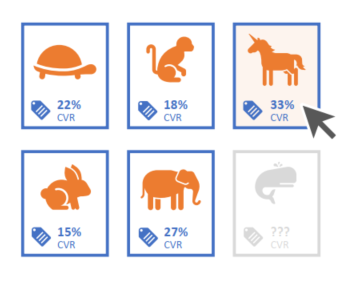
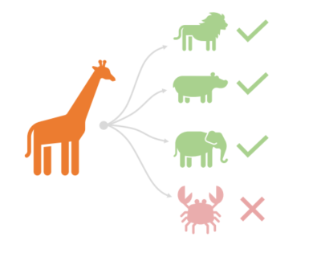
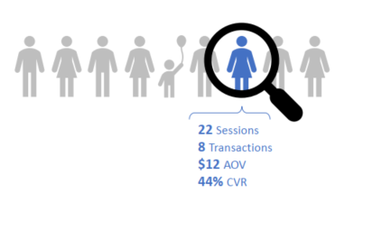

# **Data Analysis using SQL for an E-commerce Website**

---

## **Objective**
As a Database Analyst for Maven Fuzzy Factory, an eCommerce start-up, I apply advanced SQL tools and techniques to analyze business performance and uncover insights that drive growth. This project focuses on using data analysis to optimize key business areas, providing actionable insights that support strategic decision-making.

## **Project Overview** 

1. [**Traffic-Analysis-and-Optimization**](#traffic-analysis-and-optimization)
In this section, I use MySQL to analyze website traffic sources, evaluating their performance in terms of traffic volume and conversion rates. The goal is to identify patterns and optimize advertising spend by adjusting bids, ensuring better budget allocation for maximum impact.
	1. [Analysing top traffic sources](#analysing-top-traffic-sources)
	2. [Analysing traffic trend weekly from gsearch](#analysing-traffic-trend-weekly-from-gsearch)

2. [**Website Measurement & Testing**](#website-measurement-testing)
In this section, I focus on page-level website data, comparing traffic and conversion rates across different pages. Using MySQL, I build and analyze conversion funnels to gain insights into the customer purchase journey, helping to optimize the user experience and improve conversion rates.
	1. [Objective: Analyze Page Views for Different URLs](#objective-analyze-page-views-for-different-URLs)
	2. [Objective: Analyzing Landing Page Performance](#Objective-analyzing-landing-page-performance)
	3. [Objective: Conversion Funnel Analysis](#objective-conversion-funnel-analysis) 
    
5. [**Channel Analysis & Optimization**](#channel-analysis-optimization)
In this section, I delve into the traffic channel mix, analyzing both paid and free traffic sources. I break down performance by device type and write advanced SQL queries to perform time-series analysis, helping to identify trending patterns and seasonality, ultimately optimizing channel strategy for better ROI.
	1. [Objective: Channel Portfoli Analysis](#objective-channel-portfolio-analysis)
	2. [Objective: Cross Channel Bid Optimization](#cross-channel-bid-optimization)
	3. [Objective: Channel Portfolio Trends](#channel-portfolio-trends)

7. [**Product-Level Analysis**](#product-level-analysis)
In this section, I use MySQL to analyze product-level sales and conversion rates, identifying cross-selling opportunities and evaluating refund rates to maintain product quality. This analysis provides valuable insights for product optimization and improving overall sales performance.
	1. [Objective: Analyzing Order and Revenue Performance by Product](#analyzing-order-and-revenue-performance)
	2. [Objective: Trend Analysis of Products](#trend-analysis-of-products)
	3. [Objective: Product Level Website Analysis](#product-level-website-analysis)
	4. [Objective: Product-Specific Conversion Funnels](#product-specific-conversion-funnels)
	5. [Objective: Understanding Cross-Selling Product Performance](#understanding-cross-selling-product-performance)
	6. [Objective: Analyzing Product Refund Rates](#analyzing-product-refund-rates)

9. [**User-Level Analysis**](#user-level_analysis)
In this section, I focus on user behavior and repeat sessions, using MySQL data analysis techniques to identify the most valuable customers. I explore which traffic channels are driving these high-value users, enabling more targeted marketing strategies and improving customer retention.
	1. [Objective: Understanding Repeat Visitor Behavior**](#understanding-repeat-visitor-behavior)
	2. [Objective: Analysing Time to Repeat**](#analysing-time-to-repeat)
	3. [Objective: Analyzing Repeat Channel Behavior**](#repeat-channel-behavior)
	4. [Objective: Analysing New and Repeat Conversion Rates**](#analysin-new-and-repeat-conversion-rates)

---

## **Database Schema**
Below is the database schema used for this project. It also has information related to all the tables and columns associated with this project


---

## **Data Dictionary**

### Table `website_session`

<table style="border: 1px solid black; border-collapse: collapse;">
  <thead>
    <tr>
      <th style="border: 1px solid black; padding: 5px;">Column Name</th>
      <th style="border: 1px solid black; padding: 5px;">Data Type</th>
      <th style="border: 1px solid black; padding: 5px;">Description</th>
    </tr>
  </thead>
  <tbody>
    <tr>
      <td style="border: 1px solid black; padding: 5px;">website_session_id</td>
      <td style="border: 1px solid black; padding: 5px;">BIGINT</td>
      <td style="border: 1px solid black; padding: 5px;">Unique identifier for the session</td>
    </tr>
    <tr>
      <td style="border: 1px solid black; padding: 5px;">created_at</td>
      <td style="border: 1px solid black; padding: 5px;">DATETIME</td>
      <td style="border: 1px solid black; padding: 5px;">Session creation date and time</td>
    </tr>
    <tr>
      <td style="border: 1px solid black; padding: 5px;">user_id</td>
      <td style="border: 1px solid black; padding: 5px;">BIGINT</td>
      <td style="border: 1px solid black; padding: 5px;">Identifier for the user</td>
    </tr>
    <tr>
      <td style="border: 1px solid black; padding: 5px;">is_repeat_session</td>
      <td style="border: 1px solid black; padding: 5px;">BINARY</td>
      <td style="border: 1px solid black; padding: 5px;">Indicates if it's a repeat session</td>
    </tr>
    <tr>
      <td style="border: 1px solid black; padding: 5px;">utm_source</td>
      <td style="border: 1px solid black; padding: 5px;">VARCHAR(45)</td>
      <td style="border: 1px solid black; padding: 5px;">Source of the traffic</td>
    </tr>
    <tr>
      <td style="border: 1px solid black; padding: 5px;">utm_campaign</td>
      <td style="border: 1px solid black; padding: 5px;">VARCHAR(45)</td>
      <td style="border: 1px solid black; padding: 5px;">Marketing campaign details</td>
    </tr>
    <tr>
      <td style="border: 1px solid black; padding: 5px;">utm_content</td>
      <td style="border: 1px solid black; padding: 5px;">VARCHAR(45)</td>
      <td style="border: 1px solid black; padding: 5px;">Content details</td>
    </tr>
    <tr>
      <td style="border: 1px solid black; padding: 5px;">device_type</td>
      <td style="border: 1px solid black; padding: 5px;">VARCHAR(45)</td>
      <td style="border: 1px solid black; padding: 5px;">Type of device used</td>
    </tr>
    <tr>
      <td style="border: 1px solid black; padding: 5px;">http_referer</td>
      <td style="border: 1px solid black; padding: 5px;">VARCHAR(45)</td>
      <td style="border: 1px solid black; padding: 5px;">HTTP referrer</td>
    </tr>
  </tbody>
</table>


### Table `website_pageviews`

<table style="border: 1px solid black; border-collapse: collapse;">
  <thead>
    <tr>
      <th style="border: 1px solid black; padding: 5px;">Column Name</th>
      <th style="border: 1px solid black; padding: 5px;">Data Type</th>
      <th style="border: 1px solid black; padding: 5px;">Description</th>
    </tr>
  </thead>
  <tbody>
    <tr>
      <td style="border: 1px solid black; padding: 5px;">website_pageview_id</td>
      <td style="border: 1px solid black; padding: 5px;">BIGINT</td>
      <td style="border: 1px solid black; padding: 5px;">Unique identifier for the pageview</td>
    </tr>
    <tr>
      <td style="border: 1px solid black; padding: 5px;">created_at</td>
      <td style="border: 1px solid black; padding: 5px;">DATETIME</td>
      <td style="border: 1px solid black; padding: 5px;">Pageview creation date and time</td>
    </tr>
    <tr>
      <td style="border: 1px solid black; padding: 5px;">website_session_id</td>
      <td style="border: 1px solid black; padding: 5px;">BIGINT</td>
      <td style="border: 1px solid black; padding: 5px;">Associated session identifier</td>
    </tr>
    <tr>
      <td style="border: 1px solid black; padding: 5px;">pageview_url</td>
      <td style="border: 1px solid black; padding: 5px;">VARCHAR(45)</td>
      <td style="border: 1px solid black; padding: 5px;">URL of the page viewed</td>
    </tr>
  </tbody>
</table>


### Table `orders`

<table style="border: 1px solid black; border-collapse: collapse;">
  <thead>
    <tr>
      <th style="border: 1px solid black; padding: 5px;">Column Name</th>
      <th style="border: 1px solid black; padding: 5px;">Data Type</th>
      <th style="border: 1px solid black; padding: 5px;">Description</th>
    </tr>
  </thead>
  <tbody>
    <tr>
      <td style="border: 1px solid black; padding: 5px;">order_item_id</td>
      <td style="border: 1px solid black; padding: 5px;">BIGINT</td>
      <td style="border: 1px solid black; padding: 5px;">Unique identifier for the order item</td>
    </tr>
    <tr>
      <td style="border: 1px solid black; padding: 5px;">created_at</td>
      <td style="border: 1px solid black; padding: 5px;">DATETIME</td>
      <td style="border: 1px solid black; padding: 5px;">Creation date and time of the order item</td>
    </tr>
    <tr>
      <td style="border: 1px solid black; padding: 5px;">order_id</td>
      <td style="border: 1px solid black; padding: 5px;">BIGINT</td>
      <td style="border: 1px solid black; padding: 5px;">Identifier for the associated order</td>
    </tr>
    <tr>
      <td style="border: 1px solid black; padding: 5px;">product_id</td>
      <td style="border: 1px solid black; padding: 5px;">INT</td>
      <td style="border: 1px solid black; padding: 5px;">Identifier for the associated product</td>
    </tr>
    <tr>
      <td style="border: 1px solid black; padding: 5px;">is_primary_item</td>
      <td style="border: 1px solid black; padding: 5px;">BINARY</td>
      <td style="border: 1px solid black; padding: 5px;">Indicates if this is the primary item</td>
    </tr>
    <tr>
      <td style="border: 1px solid black; padding: 5px;">price_usd</td>
      <td style="border: 1px solid black; padding: 5px;">DECIMAL(6,2)</td>
      <td style="border: 1px solid black; padding: 5px;">Price in USD</td>
    </tr>
    <tr>
      <td style="border: 1px solid black; padding: 5px;">cogs_usd</td>
      <td style="border: 1px solid black; padding: 5px;">DECIMAL(6,2)</td>
      <td style="border: 1px solid black; padding: 5px;">Cost of goods sold in USD</td>
    </tr>
  </tbody>
</table>

### Table `products`

<table style="border: 1px solid black; border-collapse: collapse;">
  <thead>
    <tr>
      <th style="border: 1px solid black; padding: 5px;">Column Name</th>
      <th style="border: 1px solid black; padding: 5px;">Data Type</th>
      <th style="border: 1px solid black; padding: 5px;">Description</th>
    </tr>
  </thead>
  <tbody>
    <tr>
      <td style="border: 1px solid black; padding: 5px;">product_id</td>
      <td style="border: 1px solid black; padding: 5px;">INT</td>
      <td style="border: 1px solid black; padding: 5px;">Unique identifier for the product</td>
    </tr>
    <tr>
      <td style="border: 1px solid black; padding: 5px;">created_at</td>
      <td style="border: 1px solid black; padding: 5px;">DATETIME</td>
      <td style="border: 1px solid black; padding: 5px;">Product creation date and time</td>
    </tr>
    <tr>
      <td style="border: 1px solid black; padding: 5px;">product_name</td>
      <td style="border: 1px solid black; padding: 5px;">VARCHAR(45)</td>
      <td style="border: 1px solid black; padding: 5px;">Name of the product</td>
    </tr>
  </tbody>
</table>

### Table `order_items`

<table style="border: 1px solid black; border-collapse: collapse;">
  <thead>
    <tr>
      <th style="border: 1px solid black; padding: 5px;">Column Name</th>
      <th style="border: 1px solid black; padding: 5px;">Data Type</th>
      <th style="border: 1px solid black; padding: 5px;">Description</th>
    </tr>
  </thead>
  <tbody>
    <tr>
      <td style="border: 1px solid black; padding: 5px;">order_item_id</td>
      <td style="border: 1px solid black; padding: 5px;">BIGINT</td>
      <td style="border: 1px solid black; padding: 5px;">Unique identifier for the order item</td>
    </tr>
    <tr>
      <td style="border: 1px solid black; padding: 5px;">created_at</td>
      <td style="border: 1px solid black; padding: 5px;">DATETIME</td>
      <td style="border: 1px solid black; padding: 5px;">Creation date and time of the order item</td>
    </tr>
    <tr>
      <td style="border: 1px solid black; padding: 5px;">order_id</td>
      <td style="border: 1px solid black; padding: 5px;">BIGINT</td>
      <td style="border: 1px solid black; padding: 5px;">Identifier for the associated order</td>
    </tr>
    <tr>
      <td style="border: 1px solid black; padding: 5px;">product_id</td>
      <td style="border: 1px solid black; padding: 5px;">INT</td>
      <td style="border: 1px solid black; padding: 5px;">Identifier for the associated product</td>
    </tr>
    <tr>
      <td style="border: 1px solid black; padding: 5px;">is_primary_item</td>
      <td style="border: 1px solid black; padding: 5px;">BINARY</td>
      <td style="border: 1px solid black; padding: 5px;">Indicates if this is the primary item</td>
    </tr>
    <tr>
      <td style="border: 1px solid black; padding: 5px;">price_usd</td>
      <td style="border: 1px solid black; padding: 5px;">DECIMAL(6,2)</td>
      <td style="border: 1px solid black; padding: 5px;">Price in USD</td>
    </tr>
    <tr>
      <td style="border: 1px solid black; padding: 5px;">cogs_usd</td>
      <td style="border: 1px solid black; padding: 5px;">DECIMAL(6,2)</td>
      <td style="border: 1px solid black; padding: 5px;">Cost of goods sold in USD</td>
    </tr>
  </tbody>
</table>


### Table `order_item_refunds`

<table style="border: 1px solid black; border-collapse: collapse;">
  <thead>
    <tr>
      <th style="border: 1px solid black; padding: 5px;">Column Name</th>
      <th style="border: 1px solid black; padding: 5px;">Data Type</th>
      <th style="border: 1px solid black; padding: 5px;">Description</th>
    </tr>
  </thead>
  <tbody>
    <tr>
      <td style="border: 1px solid black; padding: 5px;">order_item_refund_id</td>
      <td style="border: 1px solid black; padding: 5px;">BIGINT</td>
      <td style="border: 1px solid black; padding: 5px;">Unique identifier for the refund</td>
    </tr>
    <tr>
      <td style="border: 1px solid black; padding: 5px;">created_at</td>
      <td style="border: 1px solid black; padding: 5px;">DATETIME</td>
      <td style="border: 1px solid black; padding: 5px;">Refund creation date and time</td>
    </tr>
    <tr>
      <td style="border: 1px solid black; padding: 5px;">order_item_id</td>
      <td style="border: 1px solid black; padding: 5px;">BIGINT</td>
      <td style="border: 1px solid black; padding: 5px;">Associated order item identifier</td>
    </tr>
    <tr>
      <td style="border: 1px solid black; padding: 5px;">refund_amount_usd</td>
      <td style="border: 1px solid black; padding: 5px;">DECIMAL(6,2)</td>
      <td style="border: 1px solid black; padding: 5px;">Refund amount in USD</td>
    </tr>
  </tbody>
</table>


---

<a name="traffic-analysis-and-optimization"></a>
## Traffic Analysis and Optimization

<a name="analysing-top-traffic-sources"></a>
### Objective - Analysing top traffic sources
  To understand customer acquisition sources, analyze conversion rates, and optimize marketing efforts by identifying high-performing traffic patterns and opportunities to improve budget allocation.

  

### Key Questions Addressed
  1. **Where are customers coming from?**  
  2. **What are the conversion rates for specific traffic patterns?**  
  
  
### Why This Analysis is Important
  - **Budget Optimization**:  
    - Shift budgets towards traffic sources driving the strongest conversion rates.  
    - Scale high-performing campaigns to maximize ROI.  
  - **Eliminating Wasteful Spend**:  
    - Identify low-converting traffic sources and reallocate resources effectively.  
  
  
### Tools and Data Sources
  - **Tables Used**:  
    - `Website_sessions`  
    - `Website_pageviews`  
    - `Orders`  
  
  - **Key Insights**:  
    - Paid traffic is tagged with **UTM (Urchin Tracking Module) parameters**.  
    - UTM parameters are appended to URLs to track specific traffic sources and campaigns.  


### Steps in the Analysis

1. **Traffic Source Identification**  
   - Use **UTM parameters** to classify and segment traffic sources

2. **Count the number of orders and website session id's**

3. **Conversion Rate Analysis**  
   - Calculate conversion rates for each traffic source using:  
     ```
     Conversion Rate = (Number of Orders) / (Website Sessions)
     ```

### SQL code for the query
```sql
SELECT
    website_sessions.utm_content,
    COUNT(DISTINCT website_sessions.website_session_id) AS sessions,
    COUNT(DISTINCT orders.order_id) AS orders,
    COUNT(DISTINCT orders.order_id) / COUNT(DISTINCT website_sessions.website_session_id) AS session_to_order_conversion_rate
FROM
    website_sessions
    LEFT JOIN orders
        ON website_sessions.website_session_id = orders.website_session_id
WHERE
    website_sessions.website_session_id BETWEEN 1000 AND 2000
GROUP BY
    website_sessions.utm_content
ORDER BY
    COUNT(DISTINCT website_sessions.website_session_id) DESC;
```
### Sample Output

<table style="border: 1px solid black; border-collapse: collapse;">
  <thead>
    <tr>
      <th style="border: 1px solid black; padding: 5px;">utm_content</th>
      <th style="border: 1px solid black; padding: 5px;">sessions</th>
      <th style="border: 1px solid black; padding: 5px;">orders</th>
      <th style="border: 1px solid black; padding: 5px;">sessions_to_order_conversion_rate</th>
    </tr>
  </thead>
  <tbody>
    <tr>
      <td style="border: 1px solid black; padding: 5px;">g_ad_1</td>
      <td style="border: 1px solid black; padding: 5px;">975</td>
      <td style="border: 1px solid black; padding: 5px;">35</td>
      <td style="border: 1px solid black; padding: 5px;">0.0359</td>
    </tr>
    <tr>
      <td style="border: 1px solid black; padding: 5px;">NULL</td>
      <td style="border: 1px solid black; padding: 5px;">18</td>
      <td style="border: 1px solid black; padding: 5px;">0</td>
      <td style="border: 1px solid black; padding: 5px;">0</td>
    </tr>
    <tr>
      <td style="border: 1px solid black; padding: 5px;">g_as_2</td>
      <td style="border: 1px solid black; padding: 5px;">6</td>
      <td style="border: 1px solid black; padding: 5px;">0</td>
      <td style="border: 1px solid black; padding: 5px;">0</td>
    </tr>
    <tr>
      <td style="border: 1px solid black; padding: 5px;">b_ad_2</td>
      <td style="border: 1px solid black; padding: 5px;">2</td>
      <td style="border: 1px solid black; padding: 5px;">0</td>
      <td style="border: 1px solid black; padding: 5px;">0</td>
    </tr>
  </tbody>
</table>

### **Key Findings**
1. **High-Performing Campaign (`g_ad_1`)**:
   - Achieved a conversion rate of **3.59%**, generating **35 orders** from **975 sessions**.
   - Clearly the standout campaign, demonstrating strong ROI and scalability potential.

2. **Organic Traffic (`NULL`)**:
   - Represented **18 sessions** with **0% conversion rate**.
   - Highlights a need to optimize organic landing pages and improve SEO strategies.

3. **Low-Performing Campaigns (`g_as_2` and `b_ad_2`)**:
   - Both campaigns had negligible traffic and **0% conversion rates**.
   - Likely suffer from poor targeting, ineffective ad content, or insufficient reach.


### **Recommendations**
1. **Scale High-Performing Campaigns**:
   - Allocate more budget to campaign `g_ad_1` to maximize conversions and revenue growth.

2. **Optimize Organic Traffic**:
   - Evaluate landing pages and align content with user intent to improve conversion rates from organic traffic.
   - Enhance SEO strategies to attract more relevant traffic.

3. **Review Low-Performing Campaigns**:
   - Reassess the targeting, messaging, and reach of `g_as_2` and `b_ad_2`.
   - Pause these campaigns if improvements cannot be achieved, and redirect funds to higher-performing campaigns.

---

<a name="analysing-traffic-trend-weekly-from-gsearch"></a>
### **Objective: Analysing traffic trend weekly from gsearch**

*   Analyze website traffic trends over time, specifically for filtered UTM parameters (e.g., source and campaign).
*   Identify weekly fluctuations in website sessions.

  

### **Key Questions:**

*   How many website sessions are we getting each week for the specified UTM parameters?
*   Are there any significant increases or decreases in sessions week over week?

### **Data Sources and Tools:**

*   **Data Source:** Website session data (e.g., `website_sessions`).
*   **Key Data Points:** `created_at`, `website_session_id`, `utm_source`, `utm_campaign`.
*   **Tools:** SQL, Data visualization tools (for trend analysis).

### **Analysis Steps (Process):**

1.  **Data Filtering:** Filter the `website_sessions` table based on the desired UTM parameters (e.g., `utm_source = 'gsearch'` and `utm_campaign = 'nonbrand'`).

2.  **Weekly Aggregation:**
    *   Extract the year and week number from the `created_at` timestamp.
    *   Determine the start date of each week.
    *   Count the distinct website sessions for each week.

3.  **Trend Analysis:**
    *   Analyze the weekly session counts to identify trends (e.g., increasing, decreasing, seasonal patterns).
    *   Calculate week-over-week changes (percentage or absolute difference).

### **SQL code for this analysis**

```sql
SELECT
    YEAR(created_at) AS yr,
    WEEK(created_at) AS wk,
    MIN(DATE(created_at)) AS week_started_at,
    COUNT(DISTINCT website_session_id) AS sessions
FROM
    website_sessions
WHERE
    created_at < '2012-05-12' -- Your original date filter
    AND utm_source = 'gsearch' -- Your UTM filters
    AND utm_campaign = 'nonbrand'
GROUP BY
    YEAR(created_at),
    WEEK(created_at)
ORDER BY
    yr, wk; -- Order by year and week
```

### **Output**
<table style="border: 1px solid black; border-collapse: collapse;">
  <thead>
    <tr>
      <th style="border: 1px solid black; padding: 5px;">yr</th>
      <th style="border: 1px solid black; padding: 5px;">wk</th>
      <th style="border: 1px solid black; padding: 5px;">week_started_at</th>
      <th style="border: 1px solid black; padding: 5px;">sessions</th>
    </tr>
  </thead>
  <tbody>
    <tr>
      <td style="border: 1px solid black; padding: 5px;">2012</td>
      <td style="border: 1px solid black; padding: 5px;">12</td>
      <td style="border: 1px solid black; padding: 5px;">3/19/2012</td>
      <td style="border: 1px solid black; padding: 5px;">896</td>
    </tr>
    <tr>
      <td style="border: 1px solid black; padding: 5px;">2012</td>
      <td style="border: 1px solid black; padding: 5px;">13</td>
      <td style="border: 1px solid black; padding: 5px;">3/25/2012</td>
      <td style="border: 1px solid black; padding: 5px;">956</td>
    </tr>
    <tr>
      <td style="border: 1px solid black; padding: 5px;">2012</td>
      <td style="border: 1px solid black; padding: 5px;">14</td>
      <td style="border: 1px solid black; padding: 5px;">4/1/2012</td>
      <td style="border: 1px solid black; padding: 5px;">1152</td>
    </tr>
    <tr>
      <td style="border: 1px solid black; padding: 5px;">2012</td>
      <td style="border: 1px solid black; padding: 5px;">15</td>
      <td style="border: 1px solid black; padding: 5px;">4/8/2012</td>
      <td style="border: 1px solid black; padding: 5px;">983</td>
    </tr>
    <tr>
      <td style="border: 1px solid black; padding: 5px;">2012</td>
      <td style="border: 1px solid black; padding: 5px;">16</td>
      <td style="border: 1px solid black; padding: 5px;">4/15/2012</td>
      <td style="border: 1px solid black; padding: 5px;">621</td>
    </tr>
    <tr>
      <td style="border: 1px solid black; padding: 5px;">2012</td>
      <td style="border: 1px solid black; padding: 5px;">17</td>
      <td style="border: 1px solid black; padding: 5px;">4/22/2012</td>
      <td style="border: 1px solid black; padding: 5px;">594</td>
    </tr>
    <tr>
      <td style="border: 1px solid black; padding: 5px;">2012</td>
      <td style="border: 1px solid black; padding: 5px;">18</td>
      <td style="border: 1px solid black; padding: 5px;">4/29/2012</td>
      <td style="border: 1px solid black; padding: 5px;">681</td>
    </tr>
    <tr>
      <td style="border: 1px solid black; padding: 5px;">2012</td>
      <td style="border: 1px solid black; padding: 5px;">19</td>
      <td style="border: 1px solid black; padding: 5px;">5/6/2012</td>
      <td style="border: 1px solid black; padding: 5px;">651</td>
    </tr>
  </tbody>
</table>

### **Actionable Recommendations**

*   **Identifying Peaks and Dips:** If there are significant peaks or dips in sessions, investigate the possible causes (e.g., marketing campaigns, seasonality, external events).
*   **Forecast Future Traffic:** Use historical trends to forecast future traffic and plan accordingly.

---
<a name="website-measurement-testing"></a>
## Website Measurement & Testing

<a name="objective-analyze-page-views-for-different-URLs"></a>
### **Objective: Analyze Page Views for Different URLs**

*   Analyze page views across various website URLs.
*   Identify the most visited pages on the website.


### **Key Questions:**

*   What are the most visited pages on the website?
*   How can we optimize the website's structure based on user behavior?

### **Data Sources and Tools:**

*   **Data Source:** Website pageview data (e.g., `website_pageviews`).
*   **Key Data Points:** `pageview_url`, `website_pageview_id`, `created_at`.
*   **Tools:** SQL, Data visualization tools (for insights).

### **Analysis Steps (Process):**

1.  **Data Aggregation:** Group the data by `pageview_url` and count distinct `website_pageview_id`.
2.  **Filtering:** Apply a date filter to exclude data after `'2012-06-09'`.
3.  **Ranking:** Sort the URLs by the total number of page views in descending order.

### **SQL Code for this Analysis**

```sql
SELECT
    pageview_url,
    COUNT(DISTINCT website_pageview_id) AS page_views
FROM
    website_pageviews
WHERE
    created_at < '2012-06-09'
GROUP BY
    pageview_url
ORDER BY
    page_views DESC;
```
### **Output**
<table style="border: 1px solid black; border-collapse: collapse;">
  <thead>
    <tr>
      <th style="border: 1px solid black; padding: 5px;">pageview_url</th>
      <th style="border: 1px solid black; padding: 5px;">page_views</th>
    </tr>
  </thead>
  <tbody>
    <tr>
      <td style="border: 1px solid black; padding: 5px;">/home</td>
      <td style="border: 1px solid black; padding: 5px;">10403</td>
    </tr>
    <tr>
      <td style="border: 1px solid black; padding: 5px;">/products</td>
      <td style="border: 1px solid black; padding: 5px;">4239</td>
    </tr>
    <tr>
      <td style="border: 1px solid black; padding: 5px;">/the-original-mr-fuzzy</td>
      <td style="border: 1px solid black; padding: 5px;">3037</td>
    </tr>
    <tr>
      <td style="border: 1px solid black; padding: 5px;">/cart</td>
      <td style="border: 1px solid black; padding: 5px;">1306</td>
    </tr>
    <tr>
      <td style="border: 1px solid black; padding: 5px;">/shipping</td>
      <td style="border: 1px solid black; padding: 5px;">869</td>
    </tr>
    <tr>
      <td style="border: 1px solid black; padding: 5px;">/billing</td>
      <td style="border: 1px solid black; padding: 5px;">716</td>
    </tr>
    <tr>
      <td style="border: 1px solid black; padding: 5px;">/thank-you-for-your-order</td>
      <td style="border: 1px solid black; padding: 5px;">306</td>
    </tr>
  </tbody>
</table>

### **Actionable Recommendations**

*   **Optimize High-Traffic Pages: Ensure that pages like /home and /products provide a seamless user experience and prominently feature key information.
*   **Improve Low-Traffic Pages: Review pages like /thank-you-for-your-order for potential enhancements to encourage user engagement.
*   **Strategic Content Placement: Use high-performing pages as platforms for driving traffic to other parts of the website.

---

<a name="Objective-analyzing-landing-page-performance"></a>
### **Objective: Analyzing Landing Page Performance**

- Understand the effectiveness of landing pages in engaging users.
- Measure the bounce rates for various landing pages to identify potential optimization opportunities.



### **Key Questions:**

1. What are the total sessions and bounce rates for each landing page?
2. Which landing pages have the highest bounce rates, and what improvements can be made?


### **Data Sources and Tools:**

- **Data Source:** Website session and pageview data (e.g., `website_sessions`, `website_pageviews`).
- **Key Data Points:** `website_session_id`, `website_pageview_id`, `pageview_url`, `created_at`.
- **Tools:** SQL.

### **Analysis Steps (Process):**

1. **Identify the First Pageview per Session:**
   - Create a temporary table to find the minimum `website_pageview_id` for each session within the specified date range.

2. **Determine Landing Pages:**
   - Join the first pageview data with `website_pageviews` to determine the landing page for each session.

3. **Identify Bounced Sessions:**
   - Count the number of pageviews per session and filter sessions with only one pageview to classify them as "bounced."

4. **Summarize Session and Bounce Data:**
   - Calculate the total sessions, bounced sessions, and bounce rate for each landing page.


### **SQL Code for This Analysis**

```sql
-- STEP 1: Finding the first website_pageview_id for relevant sessions
CREATE TEMPORARY TABLE first_pageview_demo
SELECT
	website_pageviews.website_session_id,
    MIN(website_pageviews.website_pageview_id) AS min_pageview_id
FROM
	website_pageviews
	INNER JOIN website_sessions
		ON website_sessions.website_session_id = website_pageviews.website_session_id
        AND website_sessions.created_at BETWEEN '2014-01-01' AND '2014-02-01'
GROUP BY
	website_pageviews.website_session_id;

-- STEP 2: Identify the landing page of each session
CREATE TEMPORARY TABLE sessions_w_landing_page_demo
SELECT
	first_pageview_demo.website_session_id,
    website_pageviews.pageview_url AS landing_page
FROM
	first_pageview_demo
	LEFT JOIN website_pageviews
		ON website_pageviews.website_pageview_id = first_pageview_demo.min_pageview_id;

-- STEP 3: Counting pageviews for each session, to identify "bounces"
CREATE TEMPORARY TABLE bounced_sessions_only
SELECT
	sessions_w_landing_page_demo.website_session_id,
    sessions_w_landing_page_demo.landing_page,
    COUNT(website_pageviews.website_pageview_id) AS count_of_pages_viewed
FROM
	sessions_w_landing_page_demo
	LEFT JOIN website_pageviews
		ON website_pageviews.website_session_id = sessions_w_landing_page_demo.website_session_id
GROUP BY
	sessions_w_landing_page_demo.website_session_id,
    sessions_w_landing_page_demo.landing_page
HAVING
	COUNT(website_pageviews.website_pageview_id) = 1;

-- STEP 4: Summarizing total sessions and bounced sessions by landing page
SELECT
	sessions_w_landing_page_demo.landing_page,
	COUNT(DISTINCT sessions_w_landing_page_demo.website_session_id) AS sessions,
    COUNT(DISTINCT bounced_sessions_only.website_session_id) AS bounced_sessions,
    COUNT(DISTINCT bounced_sessions_only.website_session_id) / COUNT(DISTINCT sessions_w_landing_page_demo.website_session_id) AS bounce_rate
FROM
	sessions_w_landing_page_demo
	LEFT JOIN bounced_sessions_only
		ON sessions_w_landing_page_demo.website_session_id = bounced_sessions_only.website_session_id
GROUP BY
	sessions_w_landing_page_demo.landing_page;
```
### **Output**
<table style="border: 1px solid black; border-collapse: collapse;">
  <thead>
    <tr>
      <th style="border: 1px solid black; padding: 5px;">landing_page</th>
      <th style="border: 1px solid black; padding: 5px;">sessions</th>
      <th style="border: 1px solid black; padding: 5px;">bounced_website_session_id</th>
      <th style="border: 1px solid black; padding: 5px;">bounce_rate</th>
    </tr>
  </thead>
  <tbody>
    <tr>
      <td style="border: 1px solid black; padding: 5px;">/home</td>
      <td style="border: 1px solid black; padding: 5px;">4093</td>
      <td style="border: 1px solid black; padding: 5px;">1575</td>
      <td style="border: 1px solid black; padding: 5px;">0.3848</td>
    </tr>
    <tr>
      <td style="border: 1px solid black; padding: 5px;">/lander-2</td>
      <td style="border: 1px solid black; padding: 5px;">6500</td>
      <td style="border: 1px solid black; padding: 5px;">2855</td>
      <td style="border: 1px solid black; padding: 5px;">0.4392</td>
    </tr>
    <tr>
      <td style="border: 1px solid black; padding: 5px;">/lander-3</td>
      <td style="border: 1px solid black; padding: 5px;">4232</td>
      <td style="border: 1px solid black; padding: 5px;">2606</td>
      <td style="border: 1px solid black; padding: 5px;">0.6158</td>
    </tr>
  </tbody>
</table>


### Key Insights
- **High Bounce Rates**: Pages like `/contact-us` exhibit high bounce rates, indicating potential usability or relevance issues.
- **Main Entry Points**: The `/home` page has the highest session count, serving as a key entry point.
- **Optimization Opportunities**: Focus on improving engagement on high-bounce pages through A/B testing, better content alignment, or UI enhancements.

### Actionable Recommendations
- **Improve Content Relevance**: Ensure landing pages align with the expectations set by marketing campaigns.
- **Enhance User Engagement**: Add engaging elements (e.g., CTAs, videos, or interactive content) to high-bounce pages.
- **Analyze Traffic Source**: Segment bounce rates by traffic source to pinpoint underperforming campaigns.


---


<a name="objective-conversion-funnel-analysis"></a>
### **Objective - Conversion Funnel Analysis**
To build a session-level conversion funnel and assess funnel performance by calculating clickthrough rates at each stage of the user journey.




## **Key Questions**
- How many sessions occurred during the specified timeframe?
- What are the clickthrough rates at each stage of the funnel:
  - Lander to Products page.
  - Products page to Mr. Fuzzy page.
  - Mr. Fuzzy page to the Cart page.

## **Data Sources and Tools**
- **Tables Used**: `website_sessions`, `website_pageviews`
- **Timeframe**: Data from `2014-01-01` to `2014-02-01`.
- **Tools**: SQL

## **Analysis Steps**
1. **Identify Relevant Pageviews**: Select pageviews for specific URLs that represent stages in the funnel (`/lander-2`, `/products`, `/the-original-mr-fuzzy`, `/cart`).
2. **Flag Session-Level Progress**: Use `MAX()` to identify whether sessions navigated through each stage.
3. **Aggregate and Calculate Clickthrough Rates**:
   - Calculate the proportion of sessions moving from one funnel stage to the next.

## **SQL Code**
```sql
-- STEP 1: Create session-level flags for each funnel step
CREATE TEMPORARY TABLE session_level_made_it_flags_demo
SELECT
	website_session_id,
    MAX(products_page) AS product_made_it,
    MAX(mrfuzzy_page) AS mrfuzzy_made_it,
    MAX(cart_page) AS cart_made_it
FROM (
		SELECT
			website_sessions.website_session_id,
			website_pageviews.pageview_url,
			CASE WHEN pageview_url = '/products' THEN 1 ELSE 0 END AS products_page,
			CASE WHEN pageview_url = '/the-original-mr-fuzzy' THEN 1 ELSE 0 END AS mrfuzzy_page,
			CASE WHEN pageview_url = '/cart' THEN 1 ELSE 0 END AS cart_page
		FROM
			website_sessions
				LEFT JOIN website_pageviews
					ON website_sessions.website_session_id = website_pageviews.website_session_id
		WHERE
			website_sessions.created_at BETWEEN '2014-01-01' AND '2014-02-01'
			AND website_pageviews.pageview_url IN ('/lander-2', '/products', '/the-original-mr-fuzzy', '/cart')
		ORDER BY
			website_sessions.website_session_id,
			website_pageviews.created_at
		) AS pageview_level
GROUP BY
	website_session_id;

-- STEP 2: Calculate funnel performance
SELECT
	COUNT(DISTINCT website_session_id) AS sessions,
    COUNT(DISTINCT CASE WHEN product_made_it = 1 THEN website_session_id ELSE NULL END)
		/ COUNT(DISTINCT website_session_id) AS lander_clickthrough_rate,
    COUNT(DISTINCT CASE WHEN mrfuzzy_made_it = 1 THEN website_session_id ELSE NULL END)
		/ COUNT(DISTINCT CASE WHEN product_made_it = 1 THEN website_session_id ELSE NULL END) AS products_clickthrough_rate,
    COUNT(DISTINCT CASE WHEN cart_made_it = 1 THEN website_session_id ELSE NULL END)
		/ COUNT(DISTINCT CASE WHEN mrfuzzy_made_it = 1 THEN website_session_id ELSE NULL END) AS mr_fuzzy_clickthrough_rate
FROM
	session_level_made_it_flags_demo;
```
### Output
<table style="border: 1px solid black; border-collapse: collapse;">
  <thead>
    <tr>
      <th style="border: 1px solid black; padding: 5px;">sessions</th>
      <th style="border: 1px solid black; padding: 5px;">lander_clickthrough_rate</th>
      <th style="border: 1px solid black; padding: 5px;">products_clickthrough_rate</th>
      <th style="border: 1px solid black; padding: 5px;">mr_fuzzy_clickthrough_rate</th>
    </tr>
  </thead>
  <tbody>
    <tr>
      <td style="border: 1px solid black; padding: 5px;">10644</td>
      <td style="border: 1px solid black; padding: 5px;">0.7318</td>
      <td style="border: 1px solid black; padding: 5px;">0.6133</td>
      <td style="border: 1px solid black; padding: 5px;">0.6048</td>
    </tr>
  </tbody>
</table>

### **Actionable Recommendations**
- **Optimize the Products Page**: The drop-off rate between the Products page and Mr. Fuzzy page is significant. Review the Products page for issues such as unclear navigation, lack of information, or slow load times.
- **Refine the Cart Page**: Although the Mr. Fuzzy page-to-Cart conversion rate is decent, there is room for improvement through better product descriptions, trust-building elements, or faster loading.
- **Monitor Traffic Sources**: Determine if specific traffic sources contribute to higher or lower clickthrough rates at each stage for targeted optimization.


---

<a name="channel-analysis-optimization"></a>
## **Channel Analysis & Optimization**

<a name="objective-channel-portfolio-analysis"></a>
### **Objective: Channel Portfolio Analysis**
To analyze the performance of paid traffic channels, focusing on conversion rates for sessions tagged with UTM parameters. 



### **Key Questions**
- How many sessions and orders were generated for each UTM content tag?
- What is the session-to-order conversion rate for each tag?

### **Data Sources and Tools**
- **Tables Used**: `website_sessions`, `orders`
- **Timeframe**: Data from `2012-01-01` to `2014-02-01`
- **Tools**: SQL

### **Analysis Steps**
1. **Identify Paid Traffic**: Focus on sessions with UTM content tags to track paid traffic.
2. **Session-to-Order Analysis**: Count sessions and orders, and calculate conversion rates.
3. **Group and Sort Data**: Group by UTM content and sort by session count.

### **SQL Code**
```sql
SELECT
	utm_content,
    COUNT(DISTINCT website_sessions.website_session_id) AS sessions,
    COUNT(DISTINCT orders.order_id) AS orders,
    COUNT(DISTINCT orders.order_id) / COUNT(DISTINCT website_sessions.website_session_id) AS session_to_order_conversion_rate
FROM
	website_sessions
		LEFT JOIN orders
			ON orders.website_session_id = website_sessions.website_session_id
WHERE
	website_sessions.created_at BETWEEN '2012-01-01' AND '2014-02-01'
GROUP BY 1
ORDER BY
	sessions DESC;
```
### **Output**
<table style="border: 1px solid black; border-collapse: collapse;">
  <thead>
    <tr>
      <th style="border: 1px solid black; padding: 5px;">sessions</th>
      <th style="border: 1px solid black; padding: 5px;">lander_clickthrough_rate</th>
      <th style="border: 1px solid black; padding: 5px;">products_clickthrough_rate</th>
      <th style="border: 1px solid black; padding: 5px;">mr_fuzzy_clickthrough_rate</th>
    </tr>
  </thead>
  <tbody>
    <tr>
      <td style="border: 1px solid black; padding: 5px;">10644</td>
      <td style="border: 1px solid black; padding: 5px;">0.7318</td>
      <td style="border: 1px solid black; padding: 5px;">0.6133</td>
      <td style="border: 1px solid black; padding: 5px;">0.6048</td>
    </tr>
  </tbody>
</table>

### **Actionable Recommendations**
- **Optimize Traffic Channels**: Identify and prioritize channels that drive the highest number of sessions and have the highest conversion rates, such as those with a strong "lander_clickthrough_rate."
- **Improve Landing Page Engagement**: Focus on improving the landing pages that are driving high traffic but showing lower conversion rates. Enhance the content or design to increase engagement and conversions.
- **Enhance the Product Page Experience**: If the product pages are a significant part of the conversion funnel, optimize them for better user experience, faster load times, and clearer call-to-action buttons to boost the "products_clickthrough_rate."
- **Increase Mobile Conversion Rates**: If analysis shows that mobile users are converting at a lower rate, consider optimizing the mobile user experience by simplifying the checkout process and improving page responsiveness.

---
<a name="cross-channel-bid-optimization"></a>
### **Objective: Cross Channel Bid Optimization**
To optimize bids across different channels by analyzing device types, traffic sources, and their respective conversion rates.

### **Key Questions**
- How do conversion rates differ by device type and traffic source?
- Which combinations of device type and traffic source are driving the highest conversions?

### **Data Sources and Tools**
- **Tables Used**: `website_sessions`, `orders`
- **Timeframe**: From `'2012-08-22'` to `'2012-09-19'`
- **Tools**: SQL

### **Analysis Steps**
1. **Filter Data**: Select sessions with a UTM campaign value of `'nonbrand'` within the specified date range.
2. **Join Data**: Combine `website_sessions` and `orders` tables to match sessions with orders.
3. **Aggregate Data**: Group data by device type and traffic source, counting sessions, orders, and calculating conversion rates.

### **SQL Code**
```sql
SELECT
	website_sessions.device_type,
    	website_sessions.utm_source,
    	COUNT(DISTINCT website_sessions.website_session_id) AS sessions,
    	COUNT(DISTINCT orders.order_id) AS orders,
    	COUNT(DISTINCT orders.order_id) / COUNT(DISTINCT website_sessions.website_session_id) AS conversion_rate
FROM
	website_sessions
		LEFT JOIN orders
			ON website_sessions.website_session_id = orders.website_session_id
WHERE
	website_sessions.created_at > '2012-08-22'
    AND website_sessions.created_at < '2012-09-19'
    AND website_sessions.utm_campaign = 'nonbrand'
GROUP BY
	website_sessions.device_type,
 	website_sessions.utm_source;
```
### Output
<table style="border: 1px solid black; border-collapse: collapse;">
  <thead>
    <tr>
      <th style="border: 1px solid black; padding: 5px;">device_ty</th>
      <th style="border: 1px solid black; padding: 5px;">utm_sour</th>
      <th style="border: 1px solid black; padding: 5px;">sessions</th>
      <th style="border: 1px solid black; padding: 5px;">orders</th>
      <th style="border: 1px solid black; padding: 5px;">conversion_rate</th>
    </tr>
  </thead>
  <tbody>
    <tr>
      <td style="border: 1px solid black; padding: 5px;">desktop</td>
      <td style="border: 1px solid black; padding: 5px;">bsearch</td>
      <td style="border: 1px solid black; padding: 5px;">1162</td>
      <td style="border: 1px solid black; padding: 5px;">44</td>
      <td style="border: 1px solid black; padding: 5px;">0.0379</td>
    </tr>
    <tr>
      <td style="border: 1px solid black; padding: 5px;">desktop</td>
      <td style="border: 1px solid black; padding: 5px;">gsearch</td>
      <td style="border: 1px solid black; padding: 5px;">3011</td>
      <td style="border: 1px solid black; padding: 5px;">136</td>
      <td style="border: 1px solid black; padding: 5px;">0.0452</td>
    </tr>
    <tr>
      <td style="border: 1px solid black; padding: 5px;">mobile</td>
      <td style="border: 1px solid black; padding: 5px;">bsearch</td>
      <td style="border: 1px solid black; padding: 5px;">130</td>
      <td style="border: 1px solid black; padding: 5px;">1</td>
      <td style="border: 1px solid black; padding: 5px;">0.0077</td>
    </tr>
    <tr>
      <td style="border: 1px solid black; padding: 5px;">mobile</td>
      <td style="border: 1px solid black; padding: 5px;">gsearch</td>
      <td style="border: 1px solid black; padding: 5px;">1015</td>
      <td style="border: 1px solid black; padding: 5px;">13</td>
      <td style="border: 1px solid black; padding: 5px;">0.0128</td>
    </tr>
  </tbody>
</table>

### Actionable Recommendations

- **Optimize Desktop Campaigns**:
  - Focus on improving the conversion rate for desktop traffic from "bsearch" as it has a lower conversion rate compared to "gsearch."
  - Test different ad creatives or landing pages tailored for desktop users.

- **Enhance Mobile Performance**:
  - Analyze and address the very low conversion rates for "bsearch" and "gsearch" on mobile.
  - Ensure mobile-optimized landing pages and faster load times to improve user experience.

- **Allocate Budget Effectively**:
  - Allocate more budget towards "gsearch" campaigns on both desktop and mobile, as they demonstrate higher conversion rates compared to "bsearch."

- **Run A/B Tests**:
  - Conduct A/B testing for campaign content, targeting parameters, and landing pages to identify factors impacting conversions.

- **Improve Mobile User Engagement**:
  - Implement targeted strategies such as personalized offers, simplified checkout processes, and clear calls-to-action for mobile users.

- **Analyze Drop-Offs**:
  - Investigate drop-off points in the user journey for "bsearch" traffic on mobile to understand where improvements can be made.
    


---


 
<a name="channel-portfolio-trends"></a>
### **Objective: Channel Portfolio Trends**
Understanding the trends in channel performance for "gsearch" and "bsearch" sources across desktop and mobile devices.

### **Key Questions**:
- What are the trends in session counts for "gsearch" and "bsearch" on desktop and mobile devices?
- How does the performance of "bsearch" compare to "gsearch" across different devices?
- What is the percentage of "bsearch" sessions relative to "gsearch" sessions for each device?

### **Data Sources and Tools**:
- **Tables**: `website_sessions`
- **Key Metrics**: Sessions, conversion rates, device type, traffic source (utm_source).

### **Steps in the Analysis**:
1. Select relevant session data for desktop and mobile devices.
2. Filter for sessions from "gsearch" and "bsearch" sources.
3. Calculate the number of sessions for each combination of traffic source and device type.
4. Compute the percentage of "bsearch" sessions relative to "gsearch" for desktop and mobile.

### **SQL Code**:
```sql
-- Channel portfolio trends

SELECT
    MIN(DATE(created_at)) AS week_start_date,
    COUNT(DISTINCT CASE WHEN utm_source = 'gsearch' AND device_type = 'desktop' THEN website_session_id ELSE NULL END) AS gsearch_desktop_sessions,
    COUNT(DISTINCT CASE WHEN utm_source = 'bsearch' AND device_type = 'desktop' THEN website_session_id ELSE NULL END) AS bsearch_desktop_sessions,
    COUNT(DISTINCT CASE WHEN utm_source = 'bsearch' AND device_type = 'desktop' THEN website_session_id ELSE NULL END)
        / COUNT(DISTINCT CASE WHEN utm_source = 'gsearch' AND device_type = 'desktop' THEN website_session_id ELSE NULL END) AS bsearch_percent_of_gsearch_desktop,
    COUNT(DISTINCT CASE WHEN utm_source = 'gsearch' AND device_type = 'mobile' THEN website_session_id ELSE NULL END) AS gsearch_mobile_session,
    COUNT(DISTINCT CASE WHEN utm_source = 'bsearch' AND device_type = 'mobile' THEN website_session_id ELSE NULL END) AS bsearch_mobile_session,
    COUNT(DISTINCT CASE WHEN utm_source = 'bsearch' AND device_type = 'mobile' THEN website_session_id ELSE NULL END) 
        / COUNT(DISTINCT CASE WHEN utm_source = 'gsearch' AND device_type = 'mobile' THEN website_session_id ELSE NULL END) AS bsearch_percent_of_gsearch_mobile
FROM
    website_sessions
WHERE
    created_at > '2012-11-04'
    AND created_at < '2012-12-22'
    AND utm_campaign = 'nonbrand'
GROUP BY
    YEARWEEK(created_at);
```
### **Output**
<div style="overflow-x: auto; overflow-y: auto; max-width: 100%; max-height: 400px;">
  <table style="border: 1px solid black; border-collapse: collapse;">
    <thead>
      <tr>
        <th style="border: 1px solid black; padding: 5px;">week_start_date</th>
        <th style="border: 1px solid black; padding: 5px;">gsearch_desktop_sessions</th>
        <th style="border: 1px solid black; padding: 5px;">bsearch_desktop_sessions</th>
        <th style="border: 1px solid black; padding: 5px;">bsearch_percent_of_gsearch_desktop</th>
        <th style="border: 1px solid black; padding: 5px;">gsearch_mobile_session</th>
        <th style="border: 1px solid black; padding: 5px;">bsearch_mobile_session</th>
        <th style="border: 1px solid black; padding: 5px;">bsearch_percent_of_gsearch_mobile</th>
      </tr>
    </thead>
    <tbody>
      <tr>
        <td style="border: 1px solid black; padding: 5px;">11/4/2012</td>
        <td style="border: 1px solid black; padding: 5px;">1027</td>
        <td style="border: 1px solid black; padding: 5px;">400</td>
        <td style="border: 1px solid black; padding: 5px;">0.3895</td>
        <td style="border: 1px solid black; padding: 5px;">323</td>
        <td style="border: 1px solid black; padding: 5px;">29</td>
        <td style="border: 1px solid black; padding: 5px;">0.0898</td>
      </tr>
      <tr>
        <td style="border: 1px solid black; padding: 5px;">11/11/2012</td>
        <td style="border: 1px solid black; padding: 5px;">956</td>
        <td style="border: 1px solid black; padding: 5px;">401</td>
        <td style="border: 1px solid black; padding: 5px;">0.4195</td>
        <td style="border: 1px solid black; padding: 5px;">290</td>
        <td style="border: 1px solid black; padding: 5px;">37</td>
        <td style="border: 1px solid black; padding: 5px;">0.1276</td>
      </tr>
      <tr>
        <td style="border: 1px solid black; padding: 5px;">11/18/2012</td>
        <td style="border: 1px solid black; padding: 5px;">2655</td>
        <td style="border: 1px solid black; padding: 5px;">1008</td>
        <td style="border: 1px solid black; padding: 5px;">0.3797</td>
        <td style="border: 1px solid black; padding: 5px;">853</td>
        <td style="border: 1px solid black; padding: 5px;">85</td>
        <td style="border: 1px solid black; padding: 5px;">0.0996</td>
      </tr>
      <tr>
        <td style="border: 1px solid black; padding: 5px;">11/25/2012</td>
        <td style="border: 1px solid black; padding: 5px;">2058</td>
        <td style="border: 1px solid black; padding: 5px;">843</td>
        <td style="border: 1px solid black; padding: 5px;">0.4096</td>
        <td style="border: 1px solid black; padding: 5px;">692</td>
        <td style="border: 1px solid black; padding: 5px;">62</td>
        <td style="border: 1px solid black; padding: 5px;">0.0896</td>
      </tr>
      <tr>
        <td style="border: 1px solid black; padding: 5px;">12/2/2012</td>
        <td style="border: 1px solid black; padding: 5px;">1326</td>
        <td style="border: 1px solid black; padding: 5px;">517</td>
        <td style="border: 1px solid black; padding: 5px;">0.3899</td>
        <td style="border: 1px solid black; padding: 5px;">396</td>
        <td style="border: 1px solid black; padding: 5px;">31</td>
        <td style="border: 1px solid black; padding: 5px;">0.0783</td>
      </tr>
      <tr>
        <td style="border: 1px solid black; padding: 5px;">12/9/2012</td>
        <td style="border: 1px solid black; padding: 5px;">1277</td>
        <td style="border: 1px solid black; padding: 5px;">293</td>
        <td style="border: 1px solid black; padding: 5px;">0.2294</td>
        <td style="border: 1px solid black; padding: 5px;">424</td>
        <td style="border: 1px solid black; padding: 5px;">46</td>
        <td style="border: 1px solid black; padding: 5px;">0.1085</td>
      </tr>
      <tr>
        <td style="border: 1px solid black; padding: 5px;">12/16/2012</td>
        <td style="border: 1px solid black; padding: 5px;">1270</td>
        <td style="border: 1px solid black; padding: 5px;">348</td>
        <td style="border: 1px solid black; padding: 5px;">0.2740</td>
        <td style="border: 1px solid black; padding: 5px;">376</td>
        <td style="border: 1px solid black; padding: 5px;">41</td>
        <td style="border: 1px solid black; padding: 5px;">0.1090</td>
      </tr>
    </tbody>
  </table>
</div>


### Actionable Recommendations

- **Prioritize Successful Campaigns**:
    - The **desktop channel (gsearch)** shows consistent traffic with higher conversion rates across weeks. Focus on scaling this channel, as it demonstrates good performance with a higher number of sessions and orders.
  
- **Improve Mobile Conversion**:
    - **Mobile (gsearch)** sessions show promising traffic but have lower conversion rates compared to desktop. Consider optimizing the mobile user experience (e.g., faster load times, simplified checkout) to increase conversion rates.
    - **Bsearch** sessions on mobile also have a low conversion rate, so this traffic might need additional targeting adjustments or ad creatives.
  
- **Optimize bsearch for Desktop**:
    - The **bsearch desktop sessions** show a relatively high percentage of traffic compared to **gsearch desktop**, but with lower conversion rates. Explore strategies to improve bsearch ad copy, landing page experience, or targeting for desktop users.

- **Focus on High-Impact Weeks**:
    - Weeks with higher traffic volumes such as **11/18/2012** and **11/25/2012** could indicate the success of specific marketing actions or seasonal trends. Analyzing these periods can provide insights to replicate in other weeks.
  
- **Monitor and Adjust for Mobile Trends**:
    - The **mobile bsearch** channel has a lower percentage of mobile sessions converting compared to gsearch. It would be beneficial to monitor the mobile-specific ads and consider making adjustments to targeting and ad creatives for mobile users.


---
<a name="product-level-analysis"></a>
## **Product-Level Analysis**


<a name="analyzing-order-and-revenue-performance"></a>
### **Objective: Analyzing Order and Revenue Performance by Product**




*   Evaluate the performance of primary products in terms of orders, revenue, margin, and average order value (AOV).
*   Identify the top-selling products and their contributions to overall revenue and profitability.

### **Key Questions:**

*   Which products generate the highest number of orders?
*   What is the revenue, margin, and AOV for each product?
*   Are there significant differences in profitability between products?

### **Data Sources and Tools:**

*   **Data Source:** `orders` table.
*   **Key Data Points:** `primary_product_id`, `order_id`, `price_usd`, `cogs_usd`.
*   **Tools:** SQL, Data visualization tools (for detailed product performance analysis).

### **Analysis Steps (Process):**

1. **Data Aggregation:**
   * Group the data by `primary_product_id`.
   * Calculate the total orders, revenue, margin, and average order value (AOV).

2. **Sorting and Ranking:**
   * Order the results by the count of `order_id` in descending order to identify top-performing products.

3. **Metric Calculation:**
   * Revenue = Sum of `price_usd`.
   * Margin = Sum of (`price_usd` - `cogs_usd`).
   * AOV = Average of `price_usd`.

4. **Trend Analysis:**
   * Analyze the revenue and margin contribution of each product.

### **SQL Code for this Analysis**

```sql
SELECT
    primary_product_id,
    COUNT(order_id) AS orders,
    SUM(price_usd) AS revenue,
    SUM(price_usd - cogs_usd) AS margin,
    AVG(price_usd) AS aov
FROM
    orders
GROUP BY
    primary_product_id
ORDER BY
    COUNT(order_id) DESC;
```
### Output
<table style="border: 1px solid black; border-collapse: collapse;">
  <thead>
    <tr>
      <th style="border: 1px solid black; padding: 5px;">primary_product_id</th>
      <th style="border: 1px solid black; padding: 5px;">orders</th>
      <th style="border: 1px solid black; padding: 5px;">revenue</th>
      <th style="border: 1px solid black; padding: 5px;">margin</th>
      <th style="border: 1px solid black; padding: 5px;">aov</th>
    </tr>
  </thead>
  <tbody>
    <tr>
      <td style="border: 1px solid black; padding: 5px;">1</td>
      <td style="border: 1px solid black; padding: 5px;">23,861</td>
      <td style="border: 1px solid black; padding: 5px;">1,419,768</td>
      <td style="border: 1px solid black; padding: 5px;">879,952</td>
      <td style="border: 1px solid black; padding: 5px;">59.50</td>
    </tr>
    <tr>
      <td style="border: 1px solid black; padding: 5px;">2</td>
      <td style="border: 1px solid black; padding: 5px;">4,803</td>
      <td style="border: 1px solid black; padding: 5px;">318,109.20</td>
      <td style="border: 1px solid black; padding: 5px;">200,348</td>
      <td style="border: 1px solid black; padding: 5px;">66.23</td>
    </tr>
    <tr>
      <td style="border: 1px solid black; padding: 5px;">3</td>
      <td style="border: 1px solid black; padding: 5px;">3,068</td>
      <td style="border: 1px solid black; padding: 5px;">180,857</td>
      <td style="border: 1px solid black; padding: 5px;">122,410.50</td>
      <td style="border: 1px solid black; padding: 5px;">58.95</td>
    </tr>
    <tr>
      <td style="border: 1px solid black; padding: 5px;">4</td>
      <td style="border: 1px solid black; padding: 5px;">581</td>
      <td style="border: 1px solid black; padding: 5px;">19,775.72</td>
      <td style="border: 1px solid black; padding: 5px;">13,429</td>
      <td style="border: 1px solid black; padding: 5px;">34.04</td>
    </tr>
  </tbody>
</table>

### Actionable Recommendations

- **Focus on Top Performers**:
    - The **primary_product_id 1** generates the highest number of orders (23,861), revenue (1,419,768), and margin (879,952). Scaling production and marketing for this product could maximize returns.
    - Similarly, **primary_product_id 2** also performs well and has a high AOV (66.23). Consider expanding its availability or adding complementary products to boost sales further.

- **Optimize Underperformers**:
    - **Primary_product_id 4** has a much lower order count and margin. Investigate the potential reasons for its underperformance, such as its lower AOV (34.04). Consider evaluating its pricing strategy, promotional efforts, and customer feedback to identify areas for improvement.

- **Increase AOV Across All Products**:
    - Consider strategies to increase the AOV for products, particularly **primary_product_id 4**, which has the lowest AOV. This could involve offering upsell opportunities, bundling products, or incentivizing larger purchases.

- **Monitor Margin Trends**:
    - Ensure that products like **primary_product_id 1** and **primary_product_id 2**, which generate the highest margins, continue to perform well and remain profitable. Any shifts in their cost structures should be closely monitored to preserve margins.

- **Strategic Focus on High Revenue and Margin Products**:
    - Prioritize marketing, production, and supply chain strategies that support products generating high revenue and margin, particularly **primary_product_id 1** and **primary_product_id 2**, while reevaluating strategies for the lower-performing products.

---

<a name="trend-analysis-of-products"></a>
### **Objective: Trend Analysis of Products**




*   Analyze the sales and revenue trends over a period, specifically by month and year.
*   Identify monthly fluctuations in sales volume, total revenue, and margin.

### **Key Questions:**

*   What are the monthly sales trends (number of sales) over the specified period?
*   How does total revenue and margin change month over month?

### **Data Sources and Tools:**

*   **Data Source:** Orders table.
*   **Key Data Points:** `created_at`, `order_id`, `price_usd`, `cogs_usd`.
*   **Tools:** SQL, Data visualization tools (for trend analysis).

### **Analysis Steps (Process):**

1.  **Data Filtering:** Filter the `orders` table based on the desired date range (before '2013-01-04').
2.  **Monthly Aggregation:**
    *   Extract the year and month from the `created_at` timestamp.
    *   Count the distinct `order_id` for each month to get the number of sales.
    *   Calculate the total revenue (sum of `price_usd`).
    *   Calculate the total margin (sum of `price_usd - cogs_usd`).
3.  **Trend Analysis:**
    *   Analyze the monthly trends for number of sales, revenue, and margin.
    *   Identify patterns and fluctuations month over month.

### **SQL code for this analysis**

```sql
SELECT
    YEAR(created_at) AS yr,
    MONTH(created_at) AS mnt,
    COUNT(DISTINCT order_id) AS number_od_sales,
    SUM(price_usd) AS total_revenue,
    SUM(price_usd - cogs_usd) AS total_margin
FROM
    orders
WHERE
    created_at < '2013-01-04'
GROUP BY
    YEAR(created_at),
    MONTH(created_at);
```
### ***Output***
<div style="max-height: 300px; overflow-y: auto;">
  <table style="border: 1px solid black; border-collapse: collapse; width: 100%;">
    <thead>
      <tr>
        <th style="border: 1px solid black; padding: 5px;">yr</th>
        <th style="border: 1px solid black; padding: 5px;">mnt</th>
        <th style="border: 1px solid black; padding: 5px;">number_od_sales</th>
        <th style="border: 1px solid black; padding: 5px;">total_revenue</th>
        <th style="border: 1px solid black; padding: 5px;">total_margin</th>
      </tr>
    </thead>
    <tbody>
      <tr>
        <td style="border: 1px solid black; padding: 5px;">2012</td>
        <td style="border: 1px solid black; padding: 5px;">3</td>
        <td style="border: 1px solid black; padding: 5px;">60</td>
        <td style="border: 1px solid black; padding: 5px;">2,999.4</td>
        <td style="border: 1px solid black; padding: 5px;">1,830</td>
      </tr>
      <tr>
        <td style="border: 1px solid black; padding: 5px;">2012</td>
        <td style="border: 1px solid black; padding: 5px;">4</td>
        <td style="border: 1px solid black; padding: 5px;">99</td>
        <td style="border: 1px solid black; padding: 5px;">4,949.01</td>
        <td style="border: 1px solid black; padding: 5px;">3,019.5</td>
      </tr>
      <tr>
        <td style="border: 1px solid black; padding: 5px;">2012</td>
        <td style="border: 1px solid black; padding: 5px;">5</td>
        <td style="border: 1px solid black; padding: 5px;">108</td>
        <td style="border: 1px solid black; padding: 5px;">5,398.92</td>
        <td style="border: 1px solid black; padding: 5px;">3,294</td>
      </tr>
      <tr>
        <td style="border: 1px solid black; padding: 5px;">2012</td>
        <td style="border: 1px solid black; padding: 5px;">6</td>
        <td style="border: 1px solid black; padding: 5px;">140</td>
        <td style="border: 1px solid black; padding: 5px;">6,998.6</td>
        <td style="border: 1px solid black; padding: 5px;">4,270</td>
      </tr>
      <tr>
        <td style="border: 1px solid black; padding: 5px;">2012</td>
        <td style="border: 1px solid black; padding: 5px;">7</td>
        <td style="border: 1px solid black; padding: 5px;">169</td>
        <td style="border: 1px solid black; padding: 5px;">8,448.31</td>
        <td style="border: 1px solid black; padding: 5px;">5,154.5</td>
      </tr>
      <tr>
        <td style="border: 1px solid black; padding: 5px;">2012</td>
        <td style="border: 1px solid black; padding: 5px;">8</td>
        <td style="border: 1px solid black; padding: 5px;">228</td>
        <td style="border: 1px solid black; padding: 5px;">11,397.72</td>
        <td style="border: 1px solid black; padding: 5px;">6,954</td>
      </tr>
      <tr>
        <td style="border: 1px solid black; padding: 5px;">2012</td>
        <td style="border: 1px solid black; padding: 5px;">9</td>
        <td style="border: 1px solid black; padding: 5px;">287</td>
        <td style="border: 1px solid black; padding: 5px;">14,347.13</td>
        <td style="border: 1px solid black; padding: 5px;">8,753.5</td>
      </tr>
      <tr>
        <td style="border: 1px solid black; padding: 5px;">2012</td>
        <td style="border: 1px solid black; padding: 5px;">10</td>
        <td style="border: 1px solid black; padding: 5px;">371</td>
        <td style="border: 1px solid black; padding: 5px;">18,546.29</td>
        <td style="border: 1px solid black; padding: 5px;">11,315.5</td>
      </tr>
      <tr>
        <td style="border: 1px solid black; padding: 5px;">2012</td>
        <td style="border: 1px solid black; padding: 5px;">11</td>
        <td style="border: 1px solid black; padding: 5px;">618</td>
        <td style="border: 1px solid black; padding: 5px;">30,893.82</td>
        <td style="border: 1px solid black; padding: 5px;">18,849</td>
      </tr>
      <tr>
        <td style="border: 1px solid black; padding: 5px;">2012</td>
        <td style="border: 1px solid black; padding: 5px;">12</td>
        <td style="border: 1px solid black; padding: 5px;">506</td>
        <td style="border: 1px solid black; padding: 5px;">25,294.94</td>
        <td style="border: 1px solid black; padding: 5px;">15,433</td>
      </tr>
      <tr>
        <td style="border: 1px solid black; padding: 5px;">2013</td>
        <td style="border: 1px solid black; padding: 5px;">1</td>
        <td style="border: 1px solid black; padding: 5px;">42</td>
        <td style="border: 1px solid black; padding: 5px;">2,099.58</td>
        <td style="border: 1px solid black; padding: 5px;">1,281</td>
      </tr>
    </tbody>
  </table>
</div>

### Actionable Recommendations

- **Increase Focus on Peak Months**:
    - The months **November** and **December 2012** show significant sales volumes with high revenue and margin. Consider allocating more resources to marketing efforts and promotions during these months to leverage peak performance.

- **Boost Sales in Early Months**:
    - Months like **March** and **January 2013** have lower sales. To drive growth, you might want to launch targeted campaigns during these periods to boost awareness and sales.

- **Optimize Marketing Spend Based on Revenue and Margin**:
    - Focus on months like **October 2012** where the number of sales and margins are high. Optimizing your marketing spend based on this pattern can improve ROI, especially as this month yielded the highest total revenue and margin.

- **Adjust Product Pricing or Promotions in Low Sales Months**:
    - During **March 2012**, sales were low, which indicates a potential mismatch with customer demand. Experimenting with pricing strategies or promotions may help increase sales in these slower months.
  
- **Continue Monitoring Revenue Trends in Early 2013**:
    - As **January 2013** shows a decline in both sales and revenue compared to previous months, it may be worthwhile to monitor this trend closely. Consider revisiting pricing models or exploring new customer segments to address any market changes.
 
---

<a name="product-level-website-analysis"></a>
### **Objective: Product Level Website Analysis**




*   Understand which products generate more interest on a multi-product page.
*   Analyze the impact of product conversion rates.
*   Build product-specific conversion funnels.

### **Key Questions:**

*   Which products generate the highest interest on a multi-product page?
*   What is the conversion rate from viewing a product to placing an order?
*   How can we optimize the product-specific conversion funnels for better performance?

### **Data Sources and Tools:**

*   **Data Source:** `website_pageviews`, `orders` tables.
*   **Key Data Points:** `website_session_id`, `pageview_url`, `order_id`.
*   **Tools:** SQL, Web Analytics tools (for tracking user behavior and conversion rates).

### **Analysis Steps (Process):**

1. **Data Aggregation:**
   * Group the data by `pageview_url` to segment by specific products.
   * Count distinct sessions and orders for each product page.

2. **Metric Calculation:**
   * **Viewed to Order Conversion Rate** = Count of distinct `order_id` / Count of distinct `website_session_id`.
   * This metric tracks the conversion rate from product view to order for each product page.

3. **Filtering:**
   * Focus on product pages (`/the-original-mr-fuzzy`, `/the-forever-love-bear`) within the specified date range.

4. **Comparison:**
   * Compare the conversion rates and sessions between different product pages to identify which product performs better.

### **SQL Code for this Analysis**

```sql
SELECT
    website_pageviews.pageview_url,
    COUNT(DISTINCT website_pageviews.website_session_id) AS sessions,
    COUNT(DISTINCT orders.order_id) AS orders,
    COUNT(DISTINCT orders.order_id) / COUNT(DISTINCT website_pageviews.website_session_id) AS viewed_product_to_order_conversion_rate
FROM
    website_pageviews
        LEFT JOIN orders
            ON website_pageviews.website_session_id = orders.website_session_id
WHERE
    website_pageviews.created_at BETWEEN '2013-02-01' AND '2013-03-01'
    AND website_pageviews.pageview_url IN ('/the-original-mr-fuzzy','/the-forever-love-bear')
GROUP BY
    website_pageviews.pageview_url;
```

### Output

<table style="border: 1px solid black; border-collapse: collapse;">
  <thead>
    <tr>
      <th style="border: 1px solid black; padding: 5px;">pageview_url</th>
      <th style="border: 1px solid black; padding: 5px;">sessions</th>
      <th style="border: 1px solid black; padding: 5px;">orders</th>
      <th style="border: 1px solid black; padding: 5px;">viewed_product_to_order_conversion_rate</th>
    </tr>
  </thead>
  <tbody>
    <tr>
      <td style="border: 1px solid black; padding: 5px;">/the-original-mr-fuzzy</td>
      <td style="border: 1px solid black; padding: 5px;">4,500</td>
      <td style="border: 1px solid black; padding: 5px;">450</td>
      <td style="border: 1px solid black; padding: 5px;">0.10</td>
    </tr>
    <tr>
      <td style="border: 1px solid black; padding: 5px;">/the-forever-love-bear</td>
      <td style="border: 1px solid black; padding: 5px;">6,200</td>
      <td style="border: 1px solid black; padding: 5px;">620</td>
      <td style="border: 1px solid black; padding: 5px;">0.10</td>
    </tr>
  </tbody>
</table>

### Actionable Recommendations

- **Focus on High-Converting Products:**
    - Both **/the-original-mr-fuzzy** and **/the-forever-love-bear** have a conversion rate of 0.10. Although the conversion rates are identical, **/the-forever-love-bear** generates more sessions and orders. Consider optimizing marketing efforts or offering promotions for **/the-original-mr-fuzzy** to drive higher engagement.

- **Optimize Conversion Funnels:**
    - Both product pages have similar conversion rates, indicating a potential opportunity to enhance the user experience or call-to-action on either product page. Review the product detail page, checkout process, and user feedback to identify potential friction points.

- **Increase Visibility of High-Interest Products:**
    - Given the higher number of sessions for **/the-forever-love-bear**, focus on increasing the visibility of this product, such as through banner ads or recommendations on other pages, to capitalize on its higher traffic.

- **Track Product-Specific Performance Over Time:**
    - Regularly monitor the conversion rates and sessions for each product page to track the impact of any changes made to the product pages or marketing efforts. This will help in making data-driven decisions for future optimizations.


---


<a name="product-specific-conversion-funnels"></a>
### **Objective: Product-Specific Conversion Funnels**

*   Analyze the conversion funnel for products viewed on a multi-product page.
*   Understand the progression from product page view to completing the checkout process.
*   Evaluate the drop-off rates at each stage of the funnel for each product.

### **Key Questions:**

*   What is the conversion rate for each product's journey from the product page to the checkout process?
*   Which product has the highest product page clickthrough and checkout conversion rates?
*   Where do users drop off the most in the checkout funnel?

### **Data Sources and Tools:**

*   **Data Source:** `website_pageviews`, `orders` tables.
*   **Key Data Points:** `website_session_id`, `pageview_url`, `order_id`, `website_pageview_id`.
*   **Tools:** SQL, Web Analytics tools (for tracking user behavior and conversion rates).

### **Analysis Steps (Process):**

1. **Identify Relevant Pageviews:**
   * Filter the sessions to identify pageviews for the relevant product pages (`/the-original-mr-fuzzy`, `/the-forever-love-bear`).

2. **Track Funnel Progression:**
   * Create flags for each step in the funnel (product page → cart → shipping → billing → thank-you page).

3. **Calculate Conversion Rates:**
   * Calculate the clickthrough and conversion rates for each stage in the funnel:
     - **Product Page Clickthrough Rate** = Sessions that clicked to view the product.
     - **Cart Clickthrough Rate** = Sessions that moved from product page to cart.
     - **Shipping Clickthrough Rate** = Sessions that progressed to shipping.
     - **Billing Clickthrough Rate** = Sessions that reached billing.
     - **Thank You Page Rate** = Sessions that completed the order.

4. **Evaluate Drop-Off Points:**
   * Analyze where users are most likely to drop off in the funnel for each product.

### **SQL Code for this Analysis**

```sql
-- Step 1: Identify relevant sessions and product page views
CREATE TEMPORARY TABLE sessions_seeing_product_pages
SELECT
    website_session_id,
    website_pageview_id,
    pageview_url AS product_page_seen
FROM
    website_pageviews
WHERE 
    created_at < '2013-04-10' 
    AND created_at > '2013-01-06' 
    AND pageview_url IN ('/the-original-mr-fuzzy','/the-forever-love-bear');
    
-- Step 2: Track funnel progression by creating flags for each step
CREATE TEMPORARY TABLE session_product_level_made_it_flags
SELECT
    website_session_id,
    CASE 
        WHEN product_page_seen = '/the-original-mr-fuzzy' THEN 'mrfuzzy'
        WHEN product_page_seen = '/the-forever-love-bear' THEN 'lovebear'
        ELSE 'check logic'
    END AS product_seen,
    MAX(cart_page) AS cart_made_it,
    MAX(shipping_page) AS shipping_made_it,
    MAX(billing_page) AS billing_made_it,
    MAX(thankyou_page) AS thankyou_made_it
FROM (
    SELECT
        sessions_seeing_product_pages.website_session_id,
        sessions_seeing_product_pages.product_page_seen,
        CASE WHEN pageview_url = '/cart' THEN 1 ELSE 0 END AS cart_page,
        CASE WHEN pageview_url = '/shipping' THEN 1 ELSE 0 END AS shipping_page,
        CASE WHEN pageview_url = '/billing-2' THEN 1 ELSE 0 END AS billing_page,
        CASE WHEN pageview_url = '/thank-you-for-your-order' THEN 1 ELSE 0 END AS thankyou_page
    FROM
        sessions_seeing_product_pages
        LEFT JOIN website_pageviews
            ON website_pageviews.website_session_id = sessions_seeing_product_pages.website_session_id
            AND website_pageviews.website_pageview_id > sessions_seeing_product_pages.website_pageview_id
    ORDER BY
        sessions_seeing_product_pages.website_session_id,
        website_pageviews.created_at
) AS pageview_level
GROUP BY
    website_session_id,
    CASE 
        WHEN product_page_seen = '/the-original-mr-fuzzy' THEN 'mrfuzzy'
        WHEN product_page_seen = '/the-forever-love-bear' THEN 'lovebear'
        ELSE 'check logic' 
    END;
    
-- Step 3: Generate funnel performance metrics
SELECT
    product_seen,
    COUNT(DISTINCT website_session_id) AS sessions,
    COUNT(DISTINCT CASE WHEN cart_made_it = 1 THEN website_session_id ELSE NULL END) AS to_cart,
    COUNT(DISTINCT CASE WHEN shipping_made_it = 1 THEN website_session_id ELSE NULL END) AS to_shipping,
    COUNT(DISTINCT CASE WHEN billing_made_it = 1 THEN website_session_id ELSE NULL END) AS to_billing,
    COUNT(DISTINCT CASE WHEN thankyou_made_it = 1 THEN website_session_id ELSE NULL END) AS to_thankyou
FROM
    session_product_level_made_it_flags
GROUP BY 
    product_seen;

-- Step 4: Calculate funnel clickthrough rates
SELECT
    product_seen,
    COUNT(DISTINCT website_session_id) AS sessions,
    COUNT(DISTINCT CASE WHEN cart_made_it = 1 THEN website_session_id ELSE NULL END)
        / COUNT(DISTINCT website_session_id) AS product_page_clickthrough,
    COUNT(DISTINCT CASE WHEN shipping_made_it = 1 THEN website_session_id ELSE NULL END)
        / COUNT(DISTINCT CASE WHEN cart_made_it = 1 THEN website_session_id ELSE NULL END) AS cart_clickthrough,
    COUNT(DISTINCT CASE WHEN billing_made_it = 1 THEN website_session_id ELSE NULL END)
        / COUNT(DISTINCT CASE WHEN shipping_made_it = 1 THEN website_session_id ELSE NULL END) AS shipping_clickthrough,
    COUNT(DISTINCT CASE WHEN thankyou_made_it = 1 THEN website_session_id ELSE NULL END)
        / COUNT(DISTINCT CASE WHEN billing_made_it = 1 THEN website_session_id ELSE NULL END) AS billing_clickthrough
FROM
    session_product_level_made_it_flags
GROUP BY 
    product_seen;
```
### **Output**

<table style="border: 1px solid black; border-collapse: collapse;">
  <thead>
    <tr>
      <th style="border: 1px solid black; padding: 5px;">product_seen</th>
      <th style="border: 1px solid black; padding: 5px;">sessions</th>
      <th style="border: 1px solid black; padding: 5px;">product_page_clickthrough</th>
      <th style="border: 1px solid black; padding: 5px;">cart_clickthrough</th>
      <th style="border: 1px solid black; padding: 5px;">shipping_clickthrough</th>
      <th style="border: 1px solid black; padding: 5px;">billing_clickthrough</th>
    </tr>
  </thead>
  <tbody>
    <tr>
      <td style="border: 1px solid black; padding: 5px;">lovebear</td>
      <td style="border: 1px solid black; padding: 5px;">1599</td>
      <td style="border: 1px solid black; padding: 5px;">0.5485</td>
      <td style="border: 1px solid black; padding: 5px;">0.6876</td>
      <td style="border: 1px solid black; padding: 5px;">0.8093</td>
      <td style="border: 1px solid black; padding: 5px;">0.6168</td>
    </tr>
    <tr>
      <td style="border: 1px solid black; padding: 5px;">mrfuzzy</td>
      <td style="border: 1px solid black; padding: 5px;">6985</td>
      <td style="border: 1px solid black; padding: 5px;">0.4349</td>
      <td style="border: 1px solid black; padding: 5px;">0.6860</td>
      <td style="border: 1px solid black; padding: 5px;">0.8205</td>
      <td style="border: 1px solid black; padding: 5px;">0.6363</td>
    </tr>
  </tbody>
</table>


### **Actionable Recommendations**

#### **Focus on Optimizing the Funnel for "Lovebear"**
- The "lovebear" product has a strong product page clickthrough rate (0.5485), but there is room to improve the conversion through the funnel. 
- The cart clickthrough rate is good (0.6876), but optimizing shipping and billing stages could help improve the final conversion to the thank-you page.

#### **Optimize "Mrfuzzy" Funnel Performance**
- The "mrfuzzy" product has a lower product page clickthrough rate (0.4349), indicating that more effort is needed to attract users to the product page.
- However, once users reach the cart stage (0.6860), the funnel performs relatively well through the shipping and billing stages. 
- Focus on improving engagement to increase product page views and conversion rates.

#### **Reduce Drop-offs at Billing Stage**
- Both products have a significant drop-off at the billing stage.
- Improving the user experience at the billing page or offering incentives such as discounts or easier payment options could help reduce this drop-off.

#### **Enhance the Cart-to-Shipping Conversion**
- For both products, optimizing the transition from cart to shipping is crucial. 
- This stage has the lowest clickthrough rates for both products, suggesting that users may be abandoning their carts before proceeding.
- Evaluate factors like shipping fees, delivery options, or the checkout flow to encourage progression to shipping.

---

<a name="understanding-cross-selling-product-performance"></a>
### **Objective: Understanding Cross-Selling Product Performance**




*   Evaluate the effectiveness of cross-selling products by understanding which products are often sold together and their conversion rates.
*   Measure the impact of cross-selling on overall revenue and test strategies for optimizing cross-selling performance.

### **Key Questions:**

*   Which products are commonly sold together in the same orders?
*   What is the conversion rate for cross-selling specific products (e.g., Product 1, Product 2, Product 3)?
*   How does cross-selling impact overall sales and revenue?

### **Data Sources and Tools:**

*   **Data Sources:**
    - `orders`: Contains order details, including the `primary_product_id`.
    - `order_items`: Contains information about individual items in each order, including `product_id` and `order_id`.

*   **Key Data Points:**
    - `primary_product_id`: The ID of the main product purchased.
    - `order_id`: Unique identifier for each order.
    - `product_id`: Unique identifier for each product in an order.

*   **Tools:**
    - SQL for querying data.
    - Data visualization tools (for visualizing cross-sell performance and conversion rates).

### **Analysis Steps (Process):**

1. **Data Aggregation:**
    * Group orders by `primary_product_id`.
    * Count the number of distinct `order_id` values for each product and cross-sell products (Product 1, Product 2, Product 3).

2. **Conversion Rate Calculation:**
    * Calculate the cross-sell rate for each product by dividing the count of cross-sell orders by the total number of orders.

3. **Impact Measurement:**
    * Compare the number of orders where cross-sells occurred and their corresponding conversion rates for each product.

### **SQL Code for this Analysis**

```sql
SELECT
    orders.primary_product_id,
    COUNT(DISTINCT orders.order_id) AS orders,
    COUNT(DISTINCT CASE WHEN order_items.product_id = 1 THEN orders.order_id ELSE NULL END) AS x_sells_prod1,
    COUNT(DISTINCT CASE WHEN order_items.product_id = 2 THEN orders.order_id ELSE NULL END) AS x_sells_prod2,
    COUNT(DISTINCT CASE WHEN order_items.product_id = 3 THEN orders.order_id ELSE NULL END) AS x_sells_prod3, 
    COUNT(DISTINCT CASE WHEN order_items.product_id = 1 THEN orders.order_id ELSE NULL END) / COUNT(DISTINCT orders.order_id) AS x_sells_prod1_rate,
    COUNT(DISTINCT CASE WHEN order_items.product_id = 2 THEN orders.order_id ELSE NULL END) / COUNT(DISTINCT orders.order_id) AS x_sells_prod2_rate,
    COUNT(DISTINCT CASE WHEN order_items.product_id = 3 THEN orders.order_id ELSE NULL END) / COUNT(DISTINCT orders.order_id) AS x_sells_prod3_rate
FROM
    orders
    LEFT JOIN order_items
        ON order_items.order_id = orders.order_id
        AND order_items.is_primary_item = 0 -- cross sell only
WHERE
    orders.order_id BETWEEN 10000 AND 11000
GROUP BY 
    orders.primary_product_id;
```
### **Output**
<table style="border: 1px solid black; border-collapse: collapse;">
  <thead>
    <tr>
      <th style="border: 1px solid black; padding: 5px;">primary_product_id</th>
      <th style="border: 1px solid black; padding: 5px;">orders</th>
      <th style="border: 1px solid black; padding: 5px;">x_sells_prod1</th>
      <th style="border: 1px solid black; padding: 5px;">x_sells_prod2</th>
      <th style="border: 1px solid black; padding: 5px;">x_sells_prod3</th>
      <th style="border: 1px solid black; padding: 5px;">x_sells_prod1_rate</th>
      <th style="border: 1px solid black; padding: 5px;">x_sells_prod2_rate</th>
      <th style="border: 1px solid black; padding: 5px;">x_sells_prod3_rate</th>
    </tr>
  </thead>
  <tbody>
    <tr>
      <td style="border: 1px solid black; padding: 5px;">1</td>
      <td style="border: 1px solid black; padding: 5px;">731</td>
      <td style="border: 1px solid black; padding: 5px;">0</td>
      <td style="border: 1px solid black; padding: 5px;">39</td>
      <td style="border: 1px solid black; padding: 5px;">68</td>
      <td style="border: 1px solid black; padding: 5px;">0.0000</td>
      <td style="border: 1px solid black; padding: 5px;">0.0534</td>
      <td style="border: 1px solid black; padding: 5px;">0.0930</td>
    </tr>
    <tr>
      <td style="border: 1px solid black; padding: 5px;">2</td>
      <td style="border: 1px solid black; padding: 5px;">144</td>
      <td style="border: 1px solid black; padding: 5px;">5</td>
      <td style="border: 1px solid black; padding: 5px;">0</td>
      <td style="border: 1px solid black; padding: 5px;">5</td>
      <td style="border: 1px solid black; padding: 5px;">0.0347</td>
      <td style="border: 1px solid black; padding: 5px;">0.0000</td>
      <td style="border: 1px solid black; padding: 5px;">0.0347</td>
    </tr>
    <tr>
      <td style="border: 1px solid black; padding: 5px;">3</td>
      <td style="border: 1px solid black; padding: 5px;">126</td>
      <td style="border: 1px solid black; padding: 5px;">10</td>
      <td style="border: 1px solid black; padding: 5px;">3</td>
      <td style="border: 1px solid black; padding: 5px;">0</td>
      <td style="border: 1px solid black; padding: 5px;">0.0794</td>
      <td style="border: 1px solid black; padding: 5px;">0.0238</td>
      <td style="border: 1px solid black; padding: 5px;">0.0000</td>
    </tr>
  </tbody>
</table>

### Actionable Recommendations

- **Focus on Optimizing Cross-Sell for Product 1:**
  - Product 1 has a high cross-sell rate (51.43%) with Product 1 being the most cross-sold item. Efforts should focus on increasing the visibility and incentives for cross-selling this product to enhance its impact.

- **Optimize Cross-Selling for Product 2:**
  - Product 2 shows moderate success with a cross-sell rate of 32.29%. Consider additional marketing strategies or bundle offers that feature Product 2 alongside the top-performing products to increase its cross-sell performance.

- **Explore Cross-Selling for Product 3:**
  - Product 3 shows a lower cross-sell rate (22.86%). Further testing and optimization may be needed to improve its cross-sell performance, such as adjusting its positioning on the website or offering discounts for bundling.

- **Evaluate Conversion Rates:**
  - Regularly evaluate conversion rates at each cross-sell step to ensure that customers are progressing through the funnel efficiently and that offers are effective in driving sales.


---
<a name="analyzing-product-refund-rates"></a>
### **Objective: Analyzing Product Refund Rates**


*   Evaluate refund rates for different products over time to understand quality issues, supplier performance, and the associated cost of refunds on products and overall business performance.

### **Key Questions:**

*   What are the refund rates for each product over time?
*   Which products have the highest refund rates?
*   What does this tell us about the quality of the products or the supplier’s performance?

### **Data Sources and Tools:**

*   **Data Source:** `order_items`, `order_item_refunds` tables.
*   **Key Data Points:** `order_item_id`, `product_id`, `created_at`, `order_item_refunds`.
*   **Tools:** SQL.

### **Analysis Steps (Process):**

1. **Data Aggregation:**
   * Group data by year and month.
   * Count the total orders and refunds for each product.

2. **Refund Rate Calculation:**
   * Refund Rate = Number of refunded items / Total items ordered.
   
3. **Trend Analysis:**
   * Compare refund rates for different products across time.

### **SQL Code for this Analysis**

```sql
SELECT 
    YEAR(order_items.created_at) AS yr,
    MONTH(order_items.created_at) AS mth,
    COUNT(DISTINCT CASE WHEN product_id = 1 THEN order_items.order_item_id ELSE NULL END) AS p1_orders,
    COUNT(DISTINCT CASE WHEN product_id = 1 THEN order_item_refunds.order_item_id ELSE NULL END)
        / COUNT(DISTINCT CASE WHEN product_id = 1 THEN order_items.order_item_id ELSE NULL END) AS p1_refund_rate,
    COUNT(DISTINCT CASE WHEN product_id = 2 THEN order_items.order_item_id ELSE NULL END) AS p2_orders,
    COUNT(DISTINCT CASE WHEN product_id = 2 THEN order_item_refunds.order_item_id ELSE NULL END)
        / COUNT(DISTINCT CASE WHEN product_id = 2 THEN order_items.order_item_id ELSE NULL END) AS p2_refund_rate,
    COUNT(DISTINCT CASE WHEN product_id = 3 THEN order_items.order_item_id ELSE NULL END) AS p3_orders,
    COUNT(DISTINCT CASE WHEN product_id = 3 THEN order_item_refunds.order_item_id ELSE NULL END)
        / COUNT(DISTINCT CASE WHEN product_id = 3 THEN order_items.order_item_id ELSE NULL END) AS p3_refund_rates,
    COUNT(DISTINCT CASE WHEN product_id = 4 THEN order_items.order_item_id ELSE NULL END) AS p4_orders,
    COUNT(DISTINCT CASE WHEN product_id = 4 THEN order_item_refunds.order_item_id ELSE NULL END)
        / COUNT(DISTINCT CASE WHEN product_id = 4 THEN order_items.order_item_id ELSE NULL END) AS p4_refund_rates
FROM
    order_items
    LEFT JOIN order_item_refunds
        ON order_items.order_item_id = order_item_refunds.order_item_id
WHERE
    order_items.created_at < '2014-10-15'
GROUP BY
    YEAR(order_items.created_at),
    MONTH(order_items.created_at);
```

### **Output**
<table style="border: 1px solid black; border-collapse: collapse;">
  <thead>
    <tr>
      <th style="border: 1px solid black; padding: 5px;">yr</th>
      <th style="border: 1px solid black; padding: 5px;">mth</th>
      <th style="border: 1px solid black; padding: 5px;">p1_orders</th>
      <th style="border: 1px solid black; padding: 5px;">p1_refunc</th>
      <th style="border: 1px solid black; padding: 5px;">p2_orders</th>
      <th style="border: 1px solid black; padding: 5px;">p2_refunc</th>
      <th style="border: 1px solid black; padding: 5px;">p3_orders</th>
      <th style="border: 1px solid black; padding: 5px;">p3_refunc</th>
      <th style="border: 1px solid black; padding: 5px;">p4_orders</th>
      <th style="border: 1px solid black; padding: 5px;">p4_refund_rates</th>
    </tr>
  </thead>
  <tbody>
    <tr>
      <td style="border: 1px solid black; padding: 5px;">2014</td>
      <td style="border: 1px solid black; padding: 5px;">1</td>
      <td style="border: 1px solid black; padding: 5px;">728</td>
      <td style="border: 1px solid black; padding: 5px;">0.0426</td>
      <td style="border: 1px solid black; padding: 5px;">183</td>
      <td style="border: 1px solid black; padding: 5px;">0.0219</td>
      <td style="border: 1px solid black; padding: 5px;">200</td>
      <td style="border: 1px solid black; padding: 5px;">0.0650</td>
      <td style="border: 1px solid black; padding: 5px;">0</td>
      <td style="border: 1px solid black; padding: 5px;">NULL</td>
    </tr>
    <tr>
      <td style="border: 1px solid black; padding: 5px;">2014</td>
      <td style="border: 1px solid black; padding: 5px;">2</td>
      <td style="border: 1px solid black; padding: 5px;">584</td>
      <td style="border: 1px solid black; padding: 5px;">0.0394</td>
      <td style="border: 1px solid black; padding: 5px;">351</td>
      <td style="border: 1px solid black; padding: 5px;">0.0171</td>
      <td style="border: 1px solid black; padding: 5px;">211</td>
      <td style="border: 1px solid black; padding: 5px;">0.0664</td>
      <td style="border: 1px solid black; padding: 5px;">202</td>
      <td style="border: 1px solid black; padding: 5px;">0.0099</td>
    </tr>
    <tr>
      <td style="border: 1px solid black; padding: 5px;">2014</td>
      <td style="border: 1px solid black; padding: 5px;">3</td>
      <td style="border: 1px solid black; padding: 5px;">785</td>
      <td style="border: 1px solid black; padding: 5px;">0.0306</td>
      <td style="border: 1px solid black; padding: 5px;">193</td>
      <td style="border: 1px solid black; padding: 5px;">0.0155</td>
      <td style="border: 1px solid black; padding: 5px;">244</td>
      <td style="border: 1px solid black; padding: 5px;">0.0697</td>
      <td style="border: 1px solid black; padding: 5px;">205</td>
      <td style="border: 1px solid black; padding: 5px;">0.0049</td>
    </tr>
    <tr>
      <td style="border: 1px solid black; padding: 5px;">2014</td>
      <td style="border: 1px solid black; padding: 5px;">4</td>
      <td style="border: 1px solid black; padding: 5px;">917</td>
      <td style="border: 1px solid black; padding: 5px;">0.0349</td>
      <td style="border: 1px solid black; padding: 5px;">214</td>
      <td style="border: 1px solid black; padding: 5px;">0.0187</td>
      <td style="border: 1px solid black; padding: 5px;">267</td>
      <td style="border: 1px solid black; padding: 5px;">0.0674</td>
      <td style="border: 1px solid black; padding: 5px;">259</td>
      <td style="border: 1px solid black; padding: 5px;">0.0154</td>
    </tr>
    <tr>
      <td style="border: 1px solid black; padding: 5px;">2014</td>
      <td style="border: 1px solid black; padding: 5px;">5</td>
      <td style="border: 1px solid black; padding: 5px;">1030</td>
      <td style="border: 1px solid black; padding: 5px;">0.0291</td>
      <td style="border: 1px solid black; padding: 5px;">246</td>
      <td style="border: 1px solid black; padding: 5px;">0.0163</td>
      <td style="border: 1px solid black; padding: 5px;">299</td>
      <td style="border: 1px solid black; padding: 5px;">0.0569</td>
      <td style="border: 1px solid black; padding: 5px;">298</td>
      <td style="border: 1px solid black; padding: 5px;">0.0067</td>
    </tr>
    <tr>
      <td style="border: 1px solid black; padding: 5px;">2014</td>
      <td style="border: 1px solid black; padding: 5px;">6</td>
      <td style="border: 1px solid black; padding: 5px;">893</td>
      <td style="border: 1px solid black; padding: 5px;">0.0571</td>
      <td style="border: 1px solid black; padding: 5px;">245</td>
      <td style="border: 1px solid black; padding: 5px;">0.0367</td>
      <td style="border: 1px solid black; padding: 5px;">288</td>
      <td style="border: 1px solid black; padding: 5px;">0.0556</td>
      <td style="border: 1px solid black; padding: 5px;">249</td>
      <td style="border: 1px solid black; padding: 5px;">0.0241</td>
    </tr>
    <tr>
      <td style="border: 1px solid black; padding: 5px;">2014</td>
      <td style="border: 1px solid black; padding: 5px;">7</td>
      <td style="border: 1px solid black; padding: 5px;">961</td>
      <td style="border: 1px solid black; padding: 5px;">0.0437</td>
      <td style="border: 1px solid black; padding: 5px;">244</td>
      <td style="border: 1px solid black; padding: 5px;">0.0369</td>
      <td style="border: 1px solid black; padding: 5px;">276</td>
      <td style="border: 1px solid black; padding: 5px;">0.0399</td>
      <td style="border: 1px solid black; padding: 5px;">264</td>
      <td style="border: 1px solid black; padding: 5px;">0.0152</td>
    </tr>
    <tr>
      <td style="border: 1px solid black; padding: 5px;">2014</td>
      <td style="border: 1px solid black; padding: 5px;">8</td>
      <td style="border: 1px solid black; padding: 5px;">958</td>
      <td style="border: 1px solid black; padding: 5px;">0.1378</td>
      <td style="border: 1px solid black; padding: 5px;">237</td>
      <td style="border: 1px solid black; padding: 5px;">0.0169</td>
      <td style="border: 1px solid black; padding: 5px;">294</td>
      <td style="border: 1px solid black; padding: 5px;">0.0680</td>
      <td style="border: 1px solid black; padding: 5px;">303</td>
      <td style="border: 1px solid black; padding: 5px;">0.0066</td>
    </tr>
    <tr>
      <td style="border: 1px solid black; padding: 5px;">2014</td>
      <td style="border: 1px solid black; padding: 5px;">9</td>
      <td style="border: 1px solid black; padding: 5px;">1056</td>
      <td style="border: 1px solid black; padding: 5px;">0.1326</td>
      <td style="border: 1px solid black; padding: 5px;">251</td>
      <td style="border: 1px solid black; padding: 5px;">0.0319</td>
      <td style="border: 1px solid black; padding: 5px;">317</td>
      <td style="border: 1px solid black; padding: 5px;">0.0662</td>
      <td style="border: 1px solid black; padding: 5px;">327</td>
      <td style="border: 1px solid black; padding: 5px;">0.0122</td>
    </tr>
    <tr>
      <td style="border: 1px solid black; padding: 5px;">2014</td>
      <td style="border: 1px solid black; padding: 5px;">10</td>
      <td style="border: 1px solid black; padding: 5px;">513</td>
      <td style="border: 1px solid black; padding: 5px;">0.0273</td>
      <td style="border: 1px solid black; padding: 5px;">135</td>
      <td style="border: 1px solid black; padding: 5px;">0.0074</td>
      <td style="border: 1px solid black; padding: 5px;">165</td>
      <td style="border: 1px solid black; padding: 5px;">0.0485</td>
      <td style="border: 1px solid black; padding: 5px;">155</td>
      <td style="border: 1px solid black; padding: 5px;">0.0323</td>
    </tr>
  </tbody>
</table>

### **Actionable Recommendations**

- **Focus on Reducing Refund Rates for Product 3**:  
   Product 3 has the highest refund rate. Investigate customer feedback and quality issues related to this product, and work with suppliers to resolve potential defects.

- **Monitor Product 2 Refund Trends**:  
   Product 2 shows a moderate refund rate. It is important to closely monitor this product to identify any trends or emerging issues that may affect customer satisfaction.

- **Increase Quality Control for Product 4**:  
   Product 4 has a relatively higher refund rate compared to others. Quality checks and supplier relationships should be strengthened to address potential quality issues.

- **Analyze Refund Data by Supplier**:  
   Track the performance of different suppliers to assess if some are contributing more to refund rates. If one supplier is associated with higher refunds, consider finding alternatives or renegotiating terms.

- **Monitor Seasonal Trends**:  
   Regularly analyze refund data by month to identify if there are any seasonal patterns, which could help in proactively managing stock and quality control.


---


<a name="user-level_analysis"></a>
## **User-Level Analysis**

<a name="understanding-repeat-visitor-behavior"></a>
### **Objective: Understanding Repeat Visitor Behavior**

  

*   Analyze repeat visitor behavior to better understand customer value and optimize marketing strategies.
*   Determine how often customers return, the channels they use, and whether additional marketing spending is required to bring them back.

### **Key Questions:**

*   How often are customers returning?
*   What channels are being used by repeat visitors?
*   Are we paying for these customers again?

### **Data Sources and Tools:**

*   **Data Source:** `website_sessions` table.
*   **Key Data Points:**
    - `user_id`: Identifies unique customers.
    - `website_session_id`: Tracks individual sessions.
    - `created_at`: Session timestamp.
    - `is_repeat_session`: Indicates if the session is a repeat visit.
*   **Tools:**
    - SQL for querying data.
    - Browser cookies for identifying repeat visitors.

### **Analysis Steps (Process):**

1. **Identifying New and Repeat Sessions:**
    * Extract new sessions occurring between January 1, 2014, and October 31, 2014.
    * Join new sessions with repeat sessions for the same users, ensuring repeat sessions happen after the new sessions.
    * Store the result in a temporary table called `sessions_w_repeats`.

2. **Aggregation of Repeat Sessions:**
    * Count the number of repeat sessions for each user.
    * Group by repeat session count to identify trends in user behavior.

3. **Output:**
    * Aggregate and display the number of users based on their repeat session count.

### **SQL Code for this Analysis**

```sql
-- Create a temporary table to identify new and repeat sessions
CREATE TEMPORARY TABLE sessions_w_repeats
SELECT
    new_sessions.user_id,
    new_sessions.website_session_id AS new_session_id,
    website_sessions.website_session_id AS repeat_session_id
FROM
    (
        SELECT
            user_id,
            website_session_id
        FROM
            website_sessions
        WHERE
            created_at < '2014-11-01'
            AND created_at >= '2014-01-01'
            AND is_repeat_session = 0 -- new sessions only
    ) AS new_sessions
LEFT JOIN website_sessions
    ON website_sessions.user_id = new_sessions.user_id
    AND website_sessions.is_repeat_session = 1 -- repeat sessions only
    AND website_sessions.website_session_id > new_sessions.website_session_id -- session occurred later
    AND website_sessions.created_at < '2014-11-01'
    AND website_sessions.created_at >= '2014-01-01';

-- Aggregate repeat session data by user and overall
SELECT
    repeat_sessions,
    COUNT(DISTINCT user_id) AS users
FROM
    (
        SELECT
            user_id,
            COUNT(DISTINCT new_session_id) AS new_sessions,
            COUNT(DISTINCT repeat_session_id) AS repeat_sessions
        FROM
            sessions_w_repeats
        GROUP BY
            user_id
        ORDER BY
            COUNT(DISTINCT repeat_session_id)
    ) AS user_level
GROUP BY 
    repeat_sessions;
```

### **Output**
<table style="border: 1px solid black; border-collapse: collapse;">
  <thead>
    <tr>
      <th style="border: 1px solid black; padding: 5px;">repeat_sessions</th>
      <th style="border: 1px solid black; padding: 5px;">users</th>
    </tr>
  </thead>
  <tbody>
    <tr>
      <td style="border: 1px solid black; padding: 5px;">0</td>
      <td style="border: 1px solid black; padding: 5px;">126813</td>
    </tr>
    <tr>
      <td style="border: 1px solid black; padding: 5px;">1</td>
      <td style="border: 1px solid black; padding: 5px;">14086</td>
    </tr>
    <tr>
      <td style="border: 1px solid black; padding: 5px;">2</td>
      <td style="border: 1px solid black; padding: 5px;">315</td>
    </tr>
    <tr>
      <td style="border: 1px solid black; padding: 5px;">3</td>
      <td style="border: 1px solid black; padding: 5px;">4686</td>
    </tr>
  </tbody>
</table>


### **Actionable Recommendations**

- **Focus on Engaging First-Time Visitors (0 repeat sessions):**
    - **Strategy:** Target the 126,813 users who haven't returned with personalized re-engagement campaigns. Consider using email marketing, retargeting ads, or push notifications to bring them back.
    - **Objective:** Increase the likelihood of converting these users into repeat visitors by offering incentives like discounts or exclusive content.

- **Enhance Retention for Single Repeat Visitors (1 repeat session):**
    - **Strategy:** Focus on the 14,086 users who have returned once but have not yet made multiple visits. Use strategies like loyalty programs, reminder emails, or tailored recommendations to encourage more frequent visits.
    - **Objective:** Turn these users into regular visitors and boost customer lifetime value.

- **Leverage Strategies for High Engagement (2 repeat sessions):**
    - **Strategy:** For the 315 users who have visited twice, offer deeper engagement opportunities, such as personalized offers or exclusive perks for frequent visitors.
    - **Objective:** Foster loyalty and increase the likelihood of repeat sessions by making these users feel valued and offering incentives for continued interaction.

- **Reward Highly Engaged Users (3 repeat sessions):**
    - **Strategy:** Reward the 4,686 users who have visited three times with loyalty incentives, VIP status, or exclusive offers. Consider implementing a referral program to incentivize them to bring in new users.
    - **Objective:** Strengthen the relationship with highly engaged users and maximize their lifetime value by making them advocates for your brand.

- **Monitor Repeat Session Trends Regularly:**
    - **Strategy:** Track the repeat session patterns of users continuously and adjust marketing strategies based on how users are engaging with your platform.
    - **Objective:** Ensure marketing efforts are efficient and data-driven, responding quickly to shifts in user behavior.

---

<a name="analysing-time-to-repeat"></a>
### **Objective: Analysing Time to Repeat**

*   Analyze the time taken between a user's first session and their first repeat session to understand user engagement and retention over time.
*   Identify how long it typically takes users to return after their first visit and use this insight for targeted marketing strategies.

### **Key Questions:**

*   How much time typically passes between a user's first session and their repeat session?
*   What is the distribution of time taken for users to return for a repeat session?
*   How can we optimize marketing efforts based on time to repeat?

### **Data Sources and Tools:**

*   **Data Sources:**
    - `website_sessions`: Contains session data including `user_id`, `website_session_id`, and `created_at`.
    
*   **Key Data Points:**
    - `user_id`: Unique identifier for each user.
    - `website_session_id`: Unique session identifier.
    - `created_at`: Timestamp of when the session was created.
    - `is_repeat_session`: Flag indicating if the session is a repeat session.
    
*   **Tools:**
    - SQL for querying data.
    - Data analysis tools for calculating the time difference and aggregating data.

### **Analysis Steps (Process):**

1. **Identify Relevant Sessions:**
    - Filter for new sessions and repeat sessions based on the `created_at` date and the `is_repeat_session` flag.

2. **Find Repeating Sessions:**
    - For each new session, identify the corresponding repeat session based on the `user_id` and the session order.

3. **Find the Date for First and Second Session:**
    - Capture the `created_at` date for both the new session and the repeat session.

4. **Find the Difference:**
    - Calculate the time difference between the first and second session (in days).

5. **Aggregate User-Level Data:**
    - Aggregate the data to calculate the average, minimum, and maximum days between the first and second session for all users.

### **SQL Code for this Analysis**

```sql
CREATE TEMPORARY TABLE sessions_w_repeats_for_time_diff
SELECT
    new_sessions.user_id,
    new_sessions.website_session_id AS new_session_id,
    new_sessions.created_at AS new_session_created_at,
    website_sessions.website_session_id AS repeat_session_id,
    website_sessions.created_at AS repeat_session_created_at
FROM
    (
    SELECT
        user_id,
        website_session_id,
        created_at
    FROM
        website_sessions
    WHERE
        created_at < '2014-11-03'
        AND created_at >= '2014-01-01'
        AND is_repeat_session = 0
    ) AS new_sessions
LEFT JOIN
    website_sessions
    ON website_sessions.user_id = new_sessions.user_id
    AND website_sessions.is_repeat_session = 1
    AND website_sessions.website_session_id > new_sessions.website_session_id
    AND website_sessions.created_at < '2014-11-03'
    AND website_sessions.created_at >= '2014-01-01';

CREATE TEMPORARY TABLE user_first_to_second
SELECT
    user_id,
    DATEDIFF(second_session_created_at, new_session_created_at) AS days_first_to_second_session
FROM
    (
    SELECT
        user_id,
        new_session_id,
        new_session_created_at,
        MIN(repeat_session_id) AS second_session_id,
        MIN(repeat_session_created_at) AS second_session_created_at
    FROM
        sessions_w_repeats_for_time_diff
    WHERE
        repeat_session_id IS NOT NULL
    GROUP BY 1,2,3
    ) AS first_second;

SELECT
    AVG(days_first_to_second_session) AS avg_days_from_first_to_second,
    MIN(days_first_to_second_session) AS min_days_from_first_to_second,
    MAX(days_first_to_second_session) AS max_days_from_first_to_second
FROM
    user_first_to_second;
```
### **Output**
<table style="border: 1px solid black; border-collapse: collapse;">
  <thead>
    <tr>
      <th style="border: 1px solid black; padding: 5px;">avg_days_from_first_to_second</th>
      <th style="border: 1px solid black; padding: 5px;">min_days_from_first_to_second</th>
      <th style="border: 1px solid black; padding: 5px;">max_days_from_first_to_second</th>
    </tr>
  </thead>
  <tbody>
    <tr>
      <td style="border: 1px solid black; padding: 5px;">33.2622</td>
      <td style="border: 1px solid black; padding: 5px;">1</td>
      <td style="border: 1px solid black; padding: 5px;">69</td>
    </tr>
  </tbody>
</table>

### **Actionable Recommendations:**

1. **Focus on Retaining Customers Within 33 Days:**
   - With an average time of 33 days between a user's first and second session, strategies to retain users within this time frame should be prioritized. Consider targeted email campaigns, personalized offers, or retargeting ads to bring users back within this critical window.

2. **Evaluate Early Returners (1 Day Gap):**
   - The minimum time between first and second sessions is just 1 day. These early returners represent a segment that may already have a high level of intent or interest. Special offers or incentives could be tailored to encourage them to convert more quickly.

3. **Maximize Engagement for Users with Longer Gaps (69 Days):**
   - The longest gap between sessions is 69 days. It's important to create engagement strategies for users who take longer to return. Retargeting ads, reminders, or limited-time offers may help re-engage these users before they lose interest.

4. **Monitor User Retention Trends:**
   - Regularly track the time between first and second sessions to identify any trends or shifts in user behavior. An increase in time between sessions may indicate issues with user engagement or a need for improvement in the user experience.

5. **Optimize for User Re-engagement:**
   - Given the variability in return times (from 1 to 69 days), consider implementing automated re-engagement workflows, personalized reminders, or loyalty incentives for users who have shown interest but may not be consistently returning.


---


<a name="repeat-channel-behavior"></a>
### **Objective: Analyzing Repeat Channel Behavior**

*   Identify the different channels driving traffic and analyze repeat session behavior across these channels.
*   Measure the distribution of new and repeat sessions for each channel group.

### **Key Questions:**

*   Which channels are driving repeat visits?
*   How do repeat sessions compare across different marketing channels?
*   What is the breakdown of new and repeat sessions for each channel?

### **Data Sources and Tools:**

*   **Data Sources:**
    - `website_sessions`: Contains details about website visits, including `utm_source`, `utm_campaign`, `http_referer`, and `is_repeat_session`.

*   **Key Data Points:**
    - `utm_source`: The source of the traffic (e.g., paid, organic, etc.).
    - `utm_campaign`: The specific campaign that drove the traffic.
    - `http_referer`: The URL that referred the traffic.
    - `website_session_id`: Unique identifier for each session.
    - `is_repeat_session`: Flag indicating whether the session is a repeat session.
  
*   **Tools:**
    - SQL for querying data.

### **Analysis Steps (Process):**

1. **Identify Channel Groups:**
    * Use conditions to categorize traffic sources into groups like 'organic_search', 'paid_nonbrand', 'paid_brand', 'direct_type_in', and 'paid_social'.

2. **Session Count Calculation:**
    * Count the number of new and repeat sessions for each channel group.

### **SQL Code for this Analysis**

```sql
SELECT
	CASE
		WHEN utm_source IS NULL AND http_referer IN ('https://www.gsearch.com','https://www.bsearch.com') THEN 'organic_search'
        WHEN utm_campaign = 'nonbrand' THEN 'paid_nonbrand'
        WHEN utm_campaign = 'brand' THEN 'paid_brand'
        WHEN utm_source IS NULL AND http_referer IS NULL THEN 'direct_type_in'
        WHEN utm_source = 'socialbook' THEN 'paid_social'
	END AS channel_group,
	COUNT(CASE WHEN is_repeat_session = 0 THEN website_session_id ELSE NULL END) AS new_sessions,
    COUNT(CASE WHEN is_repeat_session = 1 THEN website_session_id ELSE NULL END) AS repeat_sessions
FROM
	website_sessions
WHERE
	created_at < '2014-11-05'
    AND created_at >= '2014-01-01'
GROUP BY
	1
ORDER BY
	3;
```

### **Output**
<table style="border: 1px solid black; border-collapse: collapse;">
  <thead>
    <tr>
      <th style="border: 1px solid black; padding: 5px;">channel_group</th>
      <th style="border: 1px solid black; padding: 5px;">new_sessions</th>
      <th style="border: 1px solid black; padding: 5px;">repeat_sessions</th>
    </tr>
  </thead>
  <tbody>
    <tr>
      <td style="border: 1px solid black; padding: 5px;">paid_social</td>
      <td style="border: 1px solid black; padding: 5px;">7652</td>
      <td style="border: 1px solid black; padding: 5px;">0</td>
    </tr>
    <tr>
      <td style="border: 1px solid black; padding: 5px;">paid_nonl</td>
      <td style="border: 1px solid black; padding: 5px;">119950</td>
      <td style="border: 1px solid black; padding: 5px;">0</td>
    </tr>
    <tr>
      <td style="border: 1px solid black; padding: 5px;">direct_typ</td>
      <td style="border: 1px solid black; padding: 5px;">6591</td>
      <td style="border: 1px solid black; padding: 5px;">10564</td>
    </tr>
    <tr>
      <td style="border: 1px solid black; padding: 5px;">paid_bran</td>
      <td style="border: 1px solid black; padding: 5px;">6432</td>
      <td style="border: 1px solid black; padding: 5px;">11027</td>
    </tr>
    <tr>
      <td style="border: 1px solid black; padding: 5px;">organic_se</td>
      <td style="border: 1px solid black; padding: 5px;">7139</td>
      <td style="border: 1px solid black; padding: 5px;">11507</td>
    </tr>
  </tbody>
</table>


### Actionable Recommendations:

1. **Optimize Paid Social and Paid Non-Brand Channels:**
   - `paid_social` and `paid_nonl` show no repeat sessions. This indicates that the traffic from these sources is not coming back. Consider adjusting your marketing strategy for these channels, such as offering re-engagement campaigns, better retargeting, or exclusive deals to attract returning users.

2. **Capitalize on Direct Type-In and Organic Search:**
   - Both `direct_typ` and `organic_se` have strong repeat sessions. It indicates that visitors from these channels are more likely to return. Invest in loyalty programs, content, and special offers to nurture these high-engagement users and convert them into repeat customers.

3. **Focus on Paid Brand for Retention:**
   - `paid_bran` has a healthy number of repeat sessions. You can strengthen brand awareness efforts further and invest in retargeting strategies to ensure users who came through this channel keep coming back.

4. **Explore Cross-Channel Synergies:**
   - There may be an opportunity to explore synergies between channels. For instance, users who land through paid ads could be retargeted with organic content to encourage repeat visits. Combining efforts across organic and paid channels may help reduce churn and maximize return on investment (ROI).

---
<a name="analysin-new-and-repeat-conversion-rates"></a>
### **Objective: Analysing New and Repeat Conversion Rates**

*   Assess the conversion rates for both new and repeat sessions to understand customer behavior.
*   Measure the revenue per session for both new and repeat visitors.
*   Optimize marketing strategies by identifying the impact of repeat customers on conversions and revenue.

### **Key Questions:**

*   What are the conversion rates for new versus repeat sessions?
*   How does the revenue per session compare between new and repeat sessions?
*   How can we optimize strategies based on conversion rates for new and repeat visitors?

### **Data Sources and Tools:**

*   **Data Sources:**
    - `website_sessions`: Contains session details, including session ID and type (new or repeat).
    - `orders`: Contains order details, including order ID, session ID, and total price.

*   **Key Data Points:**
    - `website_session_id`: Unique identifier for each session.
    - `is_repeat_session`: Indicator if the session is a repeat (1) or new (0).
    - `order_id`: Unique identifier for each order.
    - `price_usd`: The price of each order.

*   **Tools:**
    - SQL for querying data.
    - Data visualization tools for analyzing conversion rates and revenue per session.

### **Analysis Steps (Process):**

1. **Identify Session Type:**
    * Identify and distinguish between new and repeat sessions from the `website_sessions` table.

2. **Conversion Rate Calculation:**
    * Calculate conversion rates by dividing the number of orders by the number of sessions for both new and repeat sessions.

3. **Revenue Per Session Calculation:**
    * Calculate revenue per session by dividing total revenue by the number of sessions.

### **SQL Code for this Analysis**

```sql
SELECT
    is_repeat_session,
    COUNT(DISTINCT website_sessions.website_session_id) AS sessions,
    COUNT(DISTINCT orders.order_id) / COUNT(DISTINCT website_sessions.website_session_id) AS conversion_rates,
    SUM(price_usd) / COUNT(DISTINCT website_sessions.website_session_id) AS revenue_per_session
FROM
    website_sessions
    LEFT JOIN orders
        ON website_sessions.website_session_id = orders.website_session_id
WHERE
    website_sessions.created_at < '2014-11-08'
    AND website_sessions.created_at >= '2014-01-01'
GROUP BY 1;
```

### **Output**

<table style="border: 1px solid black; border-collapse: collapse;">
  <thead>
    <tr>
      <th style="border: 1px solid black; padding: 5px;">is_repeat_session</th>
      <th style="border: 1px solid black; padding: 5px;">sessions</th>
      <th style="border: 1px solid black; padding: 5px;">conversion_rates</th>
      <th style="border: 1px solid black; padding: 5px;">revenue_per_session</th>
    </tr>
  </thead>
  <tbody>
    <tr>
      <td style="border: 1px solid black; padding: 5px;">0</td>
      <td style="border: 1px solid black; padding: 5px;">149787</td>
      <td style="border: 1px solid black; padding: 5px;">0.068</td>
      <td style="border: 1px solid black; padding: 5px;">4.343754</td>
    </tr>
    <tr>
      <td style="border: 1px solid black; padding: 5px;">1</td>
      <td style="border: 1px solid black; padding: 5px;">33577</td>
      <td style="border: 1px solid black; padding: 5px;">0.0811</td>
      <td style="border: 1px solid black; padding: 5px;">5.168828</td>
    </tr>
  </tbody>
</table>

### **Actionable Recommendations:**

- **Optimize Conversion Rates for New Sessions:**
  - The conversion rate for new sessions is currently at 6.8%. Consider optimizing the user experience for new visitors, such as improving website navigation, offering targeted promotions, or enhancing the first-time user experience. This could potentially increase the likelihood of converting these users into paying customers.

- **Focus on Increasing Revenue for Repeat Sessions:**
  - The revenue per session for repeat sessions (5.17) is higher than for new sessions (4.34), which suggests that repeat customers are more valuable. Strategies like loyalty programs, personalized recommendations, and email marketing could help in increasing the lifetime value of these repeat customers.

- **Increase Repeat Session Conversion Rates:**
  - Although repeat session conversion rates (8.11%) are higher than those for new sessions, there is still room for improvement. Encourage repeat visitors to engage with promotions or exclusive offers that reward returning customers. Consider offering time-sensitive discounts to drive urgency.

- **Segmentation and Targeted Marketing:**
  - Given the difference in conversion rates between new and repeat visitors, it may be beneficial to segment your marketing efforts. Use targeted ads or content aimed specifically at new users to increase conversion rates, while also nurturing repeat customers through personalized and loyalty-driven marketing.


---


[Back to HOME](README.md)

