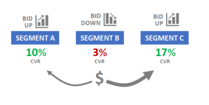

# **Data Analysis using SQL for an E-commerce Website**

---

## **Objective**
As a Database Analyst for Maven Fuzzy Factory, an eCommerce start-up, I apply advanced SQL tools and techniques to analyze business performance and uncover insights that drive growth. This project focuses on using data analysis to optimize key business areas, providing actionable insights that support strategic decision-making.

## **Project Overview** 

1. [**Traffic-Analysis-and-Optimization**](#traffic-analysis-and-optimization)
In this section, I use MySQL to analyze website traffic sources, evaluating their performance in terms of traffic volume and conversion rates. The goal is to identify patterns and optimize advertising spend by adjusting bids, ensuring better budget allocation for maximum impact.
	1. [Analysing top traffic sources](#analysing-top-traffic-sources)
	2. [Analysing traffic trend weekly from gsearch](#analysing-traffic-trend-weekly-from-gsearch)

2. [**Website Measurement & Testing**](#website-measurement-testing)
In this section, I focus on page-level website data, comparing traffic and conversion rates across different pages. Using MySQL, I build and analyze conversion funnels to gain insights into the customer purchase journey, helping to optimize the user experience and improve conversion rates.
	1. [Objective: Analyze Page Views for Different URLs](#objective-analyze-page-views-for-different-URLs)
	2. [Objective: Analyzing Landing Page Performance](#Objective-analyzing-landing-page-performance)
	3. [Objective: Conversion Funnel Analysis](#objective-conversion-funnel-analysis)
	4. [Objective: Channel Portfoli Analysis](#objective-channel-portfolio-analysis)
 
    
5. **Channel Analysis & Optimization**  
In this section, I delve into the traffic channel mix, analyzing both paid and free traffic sources. I break down performance by device type and write advanced SQL queries to perform time-series analysis, helping to identify trending patterns and seasonality, ultimately optimizing channel strategy for better ROI.

6. **Product-Level Analysis**  
In this section, I use MySQL to analyze product-level sales and conversion rates, identifying cross-selling opportunities and evaluating refund rates to maintain product quality. This analysis provides valuable insights for product optimization and improving overall sales performance.

7. **User-Level Analysis**  
In this section, I focus on user behavior and repeat sessions, using MySQL data analysis techniques to identify the most valuable customers. I explore which traffic channels are driving these high-value users, enabling more targeted marketing strategies and improving customer retention.

---

## **Database Schema**
Below is the database schema used for this project. It also has information related to all the tables and columns associated with this project


---

## **Data Dictionary**

### Table `website_session`

<table style="border: 1px solid black; border-collapse: collapse;">
  <thead>
    <tr>
      <th style="border: 1px solid black; padding: 5px;">Column Name</th>
      <th style="border: 1px solid black; padding: 5px;">Data Type</th>
      <th style="border: 1px solid black; padding: 5px;">Description</th>
    </tr>
  </thead>
  <tbody>
    <tr>
      <td style="border: 1px solid black; padding: 5px;">website_session_id</td>
      <td style="border: 1px solid black; padding: 5px;">BIGINT</td>
      <td style="border: 1px solid black; padding: 5px;">Unique identifier for the session</td>
    </tr>
    <tr>
      <td style="border: 1px solid black; padding: 5px;">created_at</td>
      <td style="border: 1px solid black; padding: 5px;">DATETIME</td>
      <td style="border: 1px solid black; padding: 5px;">Session creation date and time</td>
    </tr>
    <tr>
      <td style="border: 1px solid black; padding: 5px;">user_id</td>
      <td style="border: 1px solid black; padding: 5px;">BIGINT</td>
      <td style="border: 1px solid black; padding: 5px;">Identifier for the user</td>
    </tr>
    <tr>
      <td style="border: 1px solid black; padding: 5px;">is_repeat_session</td>
      <td style="border: 1px solid black; padding: 5px;">BINARY</td>
      <td style="border: 1px solid black; padding: 5px;">Indicates if it's a repeat session</td>
    </tr>
    <tr>
      <td style="border: 1px solid black; padding: 5px;">utm_source</td>
      <td style="border: 1px solid black; padding: 5px;">VARCHAR(45)</td>
      <td style="border: 1px solid black; padding: 5px;">Source of the traffic</td>
    </tr>
    <tr>
      <td style="border: 1px solid black; padding: 5px;">utm_campaign</td>
      <td style="border: 1px solid black; padding: 5px;">VARCHAR(45)</td>
      <td style="border: 1px solid black; padding: 5px;">Marketing campaign details</td>
    </tr>
    <tr>
      <td style="border: 1px solid black; padding: 5px;">utm_content</td>
      <td style="border: 1px solid black; padding: 5px;">VARCHAR(45)</td>
      <td style="border: 1px solid black; padding: 5px;">Content details</td>
    </tr>
    <tr>
      <td style="border: 1px solid black; padding: 5px;">device_type</td>
      <td style="border: 1px solid black; padding: 5px;">VARCHAR(45)</td>
      <td style="border: 1px solid black; padding: 5px;">Type of device used</td>
    </tr>
    <tr>
      <td style="border: 1px solid black; padding: 5px;">http_referer</td>
      <td style="border: 1px solid black; padding: 5px;">VARCHAR(45)</td>
      <td style="border: 1px solid black; padding: 5px;">HTTP referrer</td>
    </tr>
  </tbody>
</table>


### Table `website_pageviews`

<table style="border: 1px solid black; border-collapse: collapse;">
  <thead>
    <tr>
      <th style="border: 1px solid black; padding: 5px;">Column Name</th>
      <th style="border: 1px solid black; padding: 5px;">Data Type</th>
      <th style="border: 1px solid black; padding: 5px;">Description</th>
    </tr>
  </thead>
  <tbody>
    <tr>
      <td style="border: 1px solid black; padding: 5px;">website_pageview_id</td>
      <td style="border: 1px solid black; padding: 5px;">BIGINT</td>
      <td style="border: 1px solid black; padding: 5px;">Unique identifier for the pageview</td>
    </tr>
    <tr>
      <td style="border: 1px solid black; padding: 5px;">created_at</td>
      <td style="border: 1px solid black; padding: 5px;">DATETIME</td>
      <td style="border: 1px solid black; padding: 5px;">Pageview creation date and time</td>
    </tr>
    <tr>
      <td style="border: 1px solid black; padding: 5px;">website_session_id</td>
      <td style="border: 1px solid black; padding: 5px;">BIGINT</td>
      <td style="border: 1px solid black; padding: 5px;">Associated session identifier</td>
    </tr>
    <tr>
      <td style="border: 1px solid black; padding: 5px;">pageview_url</td>
      <td style="border: 1px solid black; padding: 5px;">VARCHAR(45)</td>
      <td style="border: 1px solid black; padding: 5px;">URL of the page viewed</td>
    </tr>
  </tbody>
</table>


### Table `orders`

<table style="border: 1px solid black; border-collapse: collapse;">
  <thead>
    <tr>
      <th style="border: 1px solid black; padding: 5px;">Column Name</th>
      <th style="border: 1px solid black; padding: 5px;">Data Type</th>
      <th style="border: 1px solid black; padding: 5px;">Description</th>
    </tr>
  </thead>
  <tbody>
    <tr>
      <td style="border: 1px solid black; padding: 5px;">order_item_id</td>
      <td style="border: 1px solid black; padding: 5px;">BIGINT</td>
      <td style="border: 1px solid black; padding: 5px;">Unique identifier for the order item</td>
    </tr>
    <tr>
      <td style="border: 1px solid black; padding: 5px;">created_at</td>
      <td style="border: 1px solid black; padding: 5px;">DATETIME</td>
      <td style="border: 1px solid black; padding: 5px;">Creation date and time of the order item</td>
    </tr>
    <tr>
      <td style="border: 1px solid black; padding: 5px;">order_id</td>
      <td style="border: 1px solid black; padding: 5px;">BIGINT</td>
      <td style="border: 1px solid black; padding: 5px;">Identifier for the associated order</td>
    </tr>
    <tr>
      <td style="border: 1px solid black; padding: 5px;">product_id</td>
      <td style="border: 1px solid black; padding: 5px;">INT</td>
      <td style="border: 1px solid black; padding: 5px;">Identifier for the associated product</td>
    </tr>
    <tr>
      <td style="border: 1px solid black; padding: 5px;">is_primary_item</td>
      <td style="border: 1px solid black; padding: 5px;">BINARY</td>
      <td style="border: 1px solid black; padding: 5px;">Indicates if this is the primary item</td>
    </tr>
    <tr>
      <td style="border: 1px solid black; padding: 5px;">price_usd</td>
      <td style="border: 1px solid black; padding: 5px;">DECIMAL(6,2)</td>
      <td style="border: 1px solid black; padding: 5px;">Price in USD</td>
    </tr>
    <tr>
      <td style="border: 1px solid black; padding: 5px;">cogs_usd</td>
      <td style="border: 1px solid black; padding: 5px;">DECIMAL(6,2)</td>
      <td style="border: 1px solid black; padding: 5px;">Cost of goods sold in USD</td>
    </tr>
  </tbody>
</table>

### Table `products`

<table style="border: 1px solid black; border-collapse: collapse;">
  <thead>
    <tr>
      <th style="border: 1px solid black; padding: 5px;">Column Name</th>
      <th style="border: 1px solid black; padding: 5px;">Data Type</th>
      <th style="border: 1px solid black; padding: 5px;">Description</th>
    </tr>
  </thead>
  <tbody>
    <tr>
      <td style="border: 1px solid black; padding: 5px;">product_id</td>
      <td style="border: 1px solid black; padding: 5px;">INT</td>
      <td style="border: 1px solid black; padding: 5px;">Unique identifier for the product</td>
    </tr>
    <tr>
      <td style="border: 1px solid black; padding: 5px;">created_at</td>
      <td style="border: 1px solid black; padding: 5px;">DATETIME</td>
      <td style="border: 1px solid black; padding: 5px;">Product creation date and time</td>
    </tr>
    <tr>
      <td style="border: 1px solid black; padding: 5px;">product_name</td>
      <td style="border: 1px solid black; padding: 5px;">VARCHAR(45)</td>
      <td style="border: 1px solid black; padding: 5px;">Name of the product</td>
    </tr>
  </tbody>
</table>

### Table `order_items`

<table style="border: 1px solid black; border-collapse: collapse;">
  <thead>
    <tr>
      <th style="border: 1px solid black; padding: 5px;">Column Name</th>
      <th style="border: 1px solid black; padding: 5px;">Data Type</th>
      <th style="border: 1px solid black; padding: 5px;">Description</th>
    </tr>
  </thead>
  <tbody>
    <tr>
      <td style="border: 1px solid black; padding: 5px;">order_item_id</td>
      <td style="border: 1px solid black; padding: 5px;">BIGINT</td>
      <td style="border: 1px solid black; padding: 5px;">Unique identifier for the order item</td>
    </tr>
    <tr>
      <td style="border: 1px solid black; padding: 5px;">created_at</td>
      <td style="border: 1px solid black; padding: 5px;">DATETIME</td>
      <td style="border: 1px solid black; padding: 5px;">Creation date and time of the order item</td>
    </tr>
    <tr>
      <td style="border: 1px solid black; padding: 5px;">order_id</td>
      <td style="border: 1px solid black; padding: 5px;">BIGINT</td>
      <td style="border: 1px solid black; padding: 5px;">Identifier for the associated order</td>
    </tr>
    <tr>
      <td style="border: 1px solid black; padding: 5px;">product_id</td>
      <td style="border: 1px solid black; padding: 5px;">INT</td>
      <td style="border: 1px solid black; padding: 5px;">Identifier for the associated product</td>
    </tr>
    <tr>
      <td style="border: 1px solid black; padding: 5px;">is_primary_item</td>
      <td style="border: 1px solid black; padding: 5px;">BINARY</td>
      <td style="border: 1px solid black; padding: 5px;">Indicates if this is the primary item</td>
    </tr>
    <tr>
      <td style="border: 1px solid black; padding: 5px;">price_usd</td>
      <td style="border: 1px solid black; padding: 5px;">DECIMAL(6,2)</td>
      <td style="border: 1px solid black; padding: 5px;">Price in USD</td>
    </tr>
    <tr>
      <td style="border: 1px solid black; padding: 5px;">cogs_usd</td>
      <td style="border: 1px solid black; padding: 5px;">DECIMAL(6,2)</td>
      <td style="border: 1px solid black; padding: 5px;">Cost of goods sold in USD</td>
    </tr>
  </tbody>
</table>


### Table `order_item_refunds`

<table style="border: 1px solid black; border-collapse: collapse;">
  <thead>
    <tr>
      <th style="border: 1px solid black; padding: 5px;">Column Name</th>
      <th style="border: 1px solid black; padding: 5px;">Data Type</th>
      <th style="border: 1px solid black; padding: 5px;">Description</th>
    </tr>
  </thead>
  <tbody>
    <tr>
      <td style="border: 1px solid black; padding: 5px;">order_item_refund_id</td>
      <td style="border: 1px solid black; padding: 5px;">BIGINT</td>
      <td style="border: 1px solid black; padding: 5px;">Unique identifier for the refund</td>
    </tr>
    <tr>
      <td style="border: 1px solid black; padding: 5px;">created_at</td>
      <td style="border: 1px solid black; padding: 5px;">DATETIME</td>
      <td style="border: 1px solid black; padding: 5px;">Refund creation date and time</td>
    </tr>
    <tr>
      <td style="border: 1px solid black; padding: 5px;">order_item_id</td>
      <td style="border: 1px solid black; padding: 5px;">BIGINT</td>
      <td style="border: 1px solid black; padding: 5px;">Associated order item identifier</td>
    </tr>
    <tr>
      <td style="border: 1px solid black; padding: 5px;">refund_amount_usd</td>
      <td style="border: 1px solid black; padding: 5px;">DECIMAL(6,2)</td>
      <td style="border: 1px solid black; padding: 5px;">Refund amount in USD</td>
    </tr>
  </tbody>
</table>


---

<a name="traffic-analysis-and-optimization"></a>
## Traffic Analysis and Optimization

<a name="analysing-top-traffic-sources"></a>
### Objective - Analysing top traffic sources
  To understand customer acquisition sources, analyze conversion rates, and optimize marketing efforts by identifying high-performing traffic patterns and opportunities to improve budget allocation.

  

### Key Questions Addressed
  1. **Where are customers coming from?**  
  2. **What are the conversion rates for specific traffic patterns?**  
  
  
### Why This Analysis is Important
  - **Budget Optimization**:  
    - Shift budgets towards traffic sources driving the strongest conversion rates.  
    - Scale high-performing campaigns to maximize ROI.  
  - **Eliminating Wasteful Spend**:  
    - Identify low-converting traffic sources and reallocate resources effectively.  
  
  
### Tools and Data Sources
  - **Tables Used**:  
    - `Website_sessions`  
    - `Website_pageviews`  
    - `Orders`  
  
  - **Key Insights**:  
    - Paid traffic is tagged with **UTM (Urchin Tracking Module) parameters**.  
    - UTM parameters are appended to URLs to track specific traffic sources and campaigns.  


### Steps in the Analysis

1. **Traffic Source Identification**  
   - Use **UTM parameters** to classify and segment traffic sources

2. **Count the number of orders and website session id's**

3. **Conversion Rate Analysis**  
   - Calculate conversion rates for each traffic source using:  
     ```
     Conversion Rate = (Number of Orders) / (Website Sessions)
     ```

### SQL code for the query
```sql
SELECT
    website_sessions.utm_content,
    COUNT(DISTINCT website_sessions.website_session_id) AS sessions,
    COUNT(DISTINCT orders.order_id) AS orders,
    COUNT(DISTINCT orders.order_id) / COUNT(DISTINCT website_sessions.website_session_id) AS session_to_order_conversion_rate
FROM
    website_sessions
    LEFT JOIN orders
        ON website_sessions.website_session_id = orders.website_session_id
WHERE
    website_sessions.website_session_id BETWEEN 1000 AND 2000
GROUP BY
    website_sessions.utm_content
ORDER BY
    COUNT(DISTINCT website_sessions.website_session_id) DESC;
```
### Sample Output

<table style="border: 1px solid black; border-collapse: collapse;">
  <thead>
    <tr>
      <th style="border: 1px solid black; padding: 5px;">utm_content</th>
      <th style="border: 1px solid black; padding: 5px;">sessions</th>
      <th style="border: 1px solid black; padding: 5px;">orders</th>
      <th style="border: 1px solid black; padding: 5px;">sessions_to_order_conversion_rate</th>
    </tr>
  </thead>
  <tbody>
    <tr>
      <td style="border: 1px solid black; padding: 5px;">g_ad_1</td>
      <td style="border: 1px solid black; padding: 5px;">975</td>
      <td style="border: 1px solid black; padding: 5px;">35</td>
      <td style="border: 1px solid black; padding: 5px;">0.0359</td>
    </tr>
    <tr>
      <td style="border: 1px solid black; padding: 5px;">NULL</td>
      <td style="border: 1px solid black; padding: 5px;">18</td>
      <td style="border: 1px solid black; padding: 5px;">0</td>
      <td style="border: 1px solid black; padding: 5px;">0</td>
    </tr>
    <tr>
      <td style="border: 1px solid black; padding: 5px;">g_as_2</td>
      <td style="border: 1px solid black; padding: 5px;">6</td>
      <td style="border: 1px solid black; padding: 5px;">0</td>
      <td style="border: 1px solid black; padding: 5px;">0</td>
    </tr>
    <tr>
      <td style="border: 1px solid black; padding: 5px;">b_ad_2</td>
      <td style="border: 1px solid black; padding: 5px;">2</td>
      <td style="border: 1px solid black; padding: 5px;">0</td>
      <td style="border: 1px solid black; padding: 5px;">0</td>
    </tr>
  </tbody>
</table>

### **Key Findings**
1. **High-Performing Campaign (`g_ad_1`)**:
   - Achieved a conversion rate of **3.59%**, generating **35 orders** from **975 sessions**.
   - Clearly the standout campaign, demonstrating strong ROI and scalability potential.

2. **Organic Traffic (`NULL`)**:
   - Represented **18 sessions** with **0% conversion rate**.
   - Highlights a need to optimize organic landing pages and improve SEO strategies.

3. **Low-Performing Campaigns (`g_as_2` and `b_ad_2`)**:
   - Both campaigns had negligible traffic and **0% conversion rates**.
   - Likely suffer from poor targeting, ineffective ad content, or insufficient reach.



### **Recommendations**
1. **Scale High-Performing Campaigns**:
   - Allocate more budget to campaign `g_ad_1` to maximize conversions and revenue growth.

2. **Optimize Organic Traffic**:
   - Evaluate landing pages and align content with user intent to improve conversion rates from organic traffic.
   - Enhance SEO strategies to attract more relevant traffic.

3. **Review Low-Performing Campaigns**:
   - Reassess the targeting, messaging, and reach of `g_as_2` and `b_ad_2`.
   - Pause these campaigns if improvements cannot be achieved, and redirect funds to higher-performing campaigns.

---

<a name="analysing-traffic-trend-weekly-from-gsearch"></a>
### **Objective: Analysing traffic trend weekly from gsearch**

*   Analyze website traffic trends over time, specifically for filtered UTM parameters (e.g., source and campaign).
*   Identify weekly fluctuations in website sessions.

  

### **Key Questions:**

*   How many website sessions are we getting each week for the specified UTM parameters?
*   Are there any significant increases or decreases in sessions week over week?

### **Data Sources and Tools:**

*   **Data Source:** Website session data (e.g., `website_sessions`).
*   **Key Data Points:** `created_at`, `website_session_id`, `utm_source`, `utm_campaign`.
*   **Tools:** SQL, Data visualization tools (for trend analysis).

### **Analysis Steps (Process):**

1.  **Data Filtering:** Filter the `website_sessions` table based on the desired UTM parameters (e.g., `utm_source = 'gsearch'` and `utm_campaign = 'nonbrand'`).

2.  **Weekly Aggregation:**
    *   Extract the year and week number from the `created_at` timestamp.
    *   Determine the start date of each week.
    *   Count the distinct website sessions for each week.

3.  **Trend Analysis:**
    *   Analyze the weekly session counts to identify trends (e.g., increasing, decreasing, seasonal patterns).
    *   Calculate week-over-week changes (percentage or absolute difference).

### **SQL code for this analysis**

```sql
SELECT
    YEAR(created_at) AS yr,
    WEEK(created_at) AS wk,
    MIN(DATE(created_at)) AS week_started_at,
    COUNT(DISTINCT website_session_id) AS sessions
FROM
    website_sessions
WHERE
    created_at < '2012-05-12' -- Your original date filter
    AND utm_source = 'gsearch' -- Your UTM filters
    AND utm_campaign = 'nonbrand'
GROUP BY
    YEAR(created_at),
    WEEK(created_at)
ORDER BY
    yr, wk; -- Order by year and week
```

### **Output**
<table style="border: 1px solid black; border-collapse: collapse;">
  <thead>
    <tr>
      <th style="border: 1px solid black; padding: 5px;">yr</th>
      <th style="border: 1px solid black; padding: 5px;">wk</th>
      <th style="border: 1px solid black; padding: 5px;">week_started_at</th>
      <th style="border: 1px solid black; padding: 5px;">sessions</th>
    </tr>
  </thead>
  <tbody>
    <tr>
      <td style="border: 1px solid black; padding: 5px;">2012</td>
      <td style="border: 1px solid black; padding: 5px;">12</td>
      <td style="border: 1px solid black; padding: 5px;">3/19/2012</td>
      <td style="border: 1px solid black; padding: 5px;">896</td>
    </tr>
    <tr>
      <td style="border: 1px solid black; padding: 5px;">2012</td>
      <td style="border: 1px solid black; padding: 5px;">13</td>
      <td style="border: 1px solid black; padding: 5px;">3/25/2012</td>
      <td style="border: 1px solid black; padding: 5px;">956</td>
    </tr>
    <tr>
      <td style="border: 1px solid black; padding: 5px;">2012</td>
      <td style="border: 1px solid black; padding: 5px;">14</td>
      <td style="border: 1px solid black; padding: 5px;">4/1/2012</td>
      <td style="border: 1px solid black; padding: 5px;">1152</td>
    </tr>
    <tr>
      <td style="border: 1px solid black; padding: 5px;">2012</td>
      <td style="border: 1px solid black; padding: 5px;">15</td>
      <td style="border: 1px solid black; padding: 5px;">4/8/2012</td>
      <td style="border: 1px solid black; padding: 5px;">983</td>
    </tr>
    <tr>
      <td style="border: 1px solid black; padding: 5px;">2012</td>
      <td style="border: 1px solid black; padding: 5px;">16</td>
      <td style="border: 1px solid black; padding: 5px;">4/15/2012</td>
      <td style="border: 1px solid black; padding: 5px;">621</td>
    </tr>
    <tr>
      <td style="border: 1px solid black; padding: 5px;">2012</td>
      <td style="border: 1px solid black; padding: 5px;">17</td>
      <td style="border: 1px solid black; padding: 5px;">4/22/2012</td>
      <td style="border: 1px solid black; padding: 5px;">594</td>
    </tr>
    <tr>
      <td style="border: 1px solid black; padding: 5px;">2012</td>
      <td style="border: 1px solid black; padding: 5px;">18</td>
      <td style="border: 1px solid black; padding: 5px;">4/29/2012</td>
      <td style="border: 1px solid black; padding: 5px;">681</td>
    </tr>
    <tr>
      <td style="border: 1px solid black; padding: 5px;">2012</td>
      <td style="border: 1px solid black; padding: 5px;">19</td>
      <td style="border: 1px solid black; padding: 5px;">5/6/2012</td>
      <td style="border: 1px solid black; padding: 5px;">651</td>
    </tr>
  </tbody>
</table>

### **Actionable Recommendations**

*   **Identifying Peaks and Dips:** If there are significant peaks or dips in sessions, investigate the possible causes (e.g., marketing campaigns, seasonality, external events).
*   **Forecast Future Traffic:** Use historical trends to forecast future traffic and plan accordingly.

---
<a name="website-measurement-testing"></a>
## Website Measurement & Testing

<a name="objective-analyze-page-views-for-different-URLs"></a>
### **Objective: Analyze Page Views for Different URLs**

*   Analyze page views across various website URLs.
*   Identify the most visited pages on the website.


### **Key Questions:**

*   What are the most visited pages on the website?
*   How can we optimize the website's structure based on user behavior?

### **Data Sources and Tools:**

*   **Data Source:** Website pageview data (e.g., `website_pageviews`).
*   **Key Data Points:** `pageview_url`, `website_pageview_id`, `created_at`.
*   **Tools:** SQL, Data visualization tools (for insights).

### **Analysis Steps (Process):**

1.  **Data Aggregation:** Group the data by `pageview_url` and count distinct `website_pageview_id`.
2.  **Filtering:** Apply a date filter to exclude data after `'2012-06-09'`.
3.  **Ranking:** Sort the URLs by the total number of page views in descending order.

### **SQL Code for this Analysis**

```sql
SELECT
    pageview_url,
    COUNT(DISTINCT website_pageview_id) AS page_views
FROM
    website_pageviews
WHERE
    created_at < '2012-06-09'
GROUP BY
    pageview_url
ORDER BY
    page_views DESC;
```
### **Output**
<table style="border: 1px solid black; border-collapse: collapse;">
  <thead>
    <tr>
      <th style="border: 1px solid black; padding: 5px;">pageview_url</th>
      <th style="border: 1px solid black; padding: 5px;">page_views</th>
    </tr>
  </thead>
  <tbody>
    <tr>
      <td style="border: 1px solid black; padding: 5px;">/home</td>
      <td style="border: 1px solid black; padding: 5px;">10403</td>
    </tr>
    <tr>
      <td style="border: 1px solid black; padding: 5px;">/products</td>
      <td style="border: 1px solid black; padding: 5px;">4239</td>
    </tr>
    <tr>
      <td style="border: 1px solid black; padding: 5px;">/the-original-mr-fuzzy</td>
      <td style="border: 1px solid black; padding: 5px;">3037</td>
    </tr>
    <tr>
      <td style="border: 1px solid black; padding: 5px;">/cart</td>
      <td style="border: 1px solid black; padding: 5px;">1306</td>
    </tr>
    <tr>
      <td style="border: 1px solid black; padding: 5px;">/shipping</td>
      <td style="border: 1px solid black; padding: 5px;">869</td>
    </tr>
    <tr>
      <td style="border: 1px solid black; padding: 5px;">/billing</td>
      <td style="border: 1px solid black; padding: 5px;">716</td>
    </tr>
    <tr>
      <td style="border: 1px solid black; padding: 5px;">/thank-you-for-your-order</td>
      <td style="border: 1px solid black; padding: 5px;">306</td>
    </tr>
  </tbody>
</table>

### **Actionable Recommendations**

*   **Optimize High-Traffic Pages: Ensure that pages like /home and /products provide a seamless user experience and prominently feature key information.
*   **Improve Low-Traffic Pages: Review pages like /thank-you-for-your-order for potential enhancements to encourage user engagement.
*   **Strategic Content Placement: Use high-performing pages as platforms for driving traffic to other parts of the website.

---

<a name="Objective-analyzing-landing-page-performance"></a>
### **Objective: Analyzing Landing Page Performance**

- Understand the effectiveness of landing pages in engaging users.
- Measure the bounce rates for various landing pages to identify potential optimization opportunities.


### **Key Questions:**

1. What are the total sessions and bounce rates for each landing page?
2. Which landing pages have the highest bounce rates, and what improvements can be made?


### **Data Sources and Tools:**

- **Data Source:** Website session and pageview data (e.g., `website_sessions`, `website_pageviews`).
- **Key Data Points:** `website_session_id`, `website_pageview_id`, `pageview_url`, `created_at`.
- **Tools:** SQL.

### **Analysis Steps (Process):**

1. **Identify the First Pageview per Session:**
   - Create a temporary table to find the minimum `website_pageview_id` for each session within the specified date range.

2. **Determine Landing Pages:**
   - Join the first pageview data with `website_pageviews` to determine the landing page for each session.

3. **Identify Bounced Sessions:**
   - Count the number of pageviews per session and filter sessions with only one pageview to classify them as "bounced."

4. **Summarize Session and Bounce Data:**
   - Calculate the total sessions, bounced sessions, and bounce rate for each landing page.


### **SQL Code for This Analysis**

```sql
-- STEP 1: Finding the first website_pageview_id for relevant sessions
CREATE TEMPORARY TABLE first_pageview_demo
SELECT
	website_pageviews.website_session_id,
    MIN(website_pageviews.website_pageview_id) AS min_pageview_id
FROM
	website_pageviews
	INNER JOIN website_sessions
		ON website_sessions.website_session_id = website_pageviews.website_session_id
        AND website_sessions.created_at BETWEEN '2014-01-01' AND '2014-02-01'
GROUP BY
	website_pageviews.website_session_id;

-- STEP 2: Identify the landing page of each session
CREATE TEMPORARY TABLE sessions_w_landing_page_demo
SELECT
	first_pageview_demo.website_session_id,
    website_pageviews.pageview_url AS landing_page
FROM
	first_pageview_demo
	LEFT JOIN website_pageviews
		ON website_pageviews.website_pageview_id = first_pageview_demo.min_pageview_id;

-- STEP 3: Counting pageviews for each session, to identify "bounces"
CREATE TEMPORARY TABLE bounced_sessions_only
SELECT
	sessions_w_landing_page_demo.website_session_id,
    sessions_w_landing_page_demo.landing_page,
    COUNT(website_pageviews.website_pageview_id) AS count_of_pages_viewed
FROM
	sessions_w_landing_page_demo
	LEFT JOIN website_pageviews
		ON website_pageviews.website_session_id = sessions_w_landing_page_demo.website_session_id
GROUP BY
	sessions_w_landing_page_demo.website_session_id,
    sessions_w_landing_page_demo.landing_page
HAVING
	COUNT(website_pageviews.website_pageview_id) = 1;

-- STEP 4: Summarizing total sessions and bounced sessions by landing page
SELECT
	sessions_w_landing_page_demo.landing_page,
	COUNT(DISTINCT sessions_w_landing_page_demo.website_session_id) AS sessions,
    COUNT(DISTINCT bounced_sessions_only.website_session_id) AS bounced_sessions,
    COUNT(DISTINCT bounced_sessions_only.website_session_id) / COUNT(DISTINCT sessions_w_landing_page_demo.website_session_id) AS bounce_rate
FROM
	sessions_w_landing_page_demo
	LEFT JOIN bounced_sessions_only
		ON sessions_w_landing_page_demo.website_session_id = bounced_sessions_only.website_session_id
GROUP BY
	sessions_w_landing_page_demo.landing_page;
```
### **Output**
<table style="border: 1px solid black; border-collapse: collapse;">
  <thead>
    <tr>
      <th style="border: 1px solid black; padding: 5px;">landing_page</th>
      <th style="border: 1px solid black; padding: 5px;">sessions</th>
      <th style="border: 1px solid black; padding: 5px;">bounced_website_session_id</th>
      <th style="border: 1px solid black; padding: 5px;">bounce_rate</th>
    </tr>
  </thead>
  <tbody>
    <tr>
      <td style="border: 1px solid black; padding: 5px;">/home</td>
      <td style="border: 1px solid black; padding: 5px;">4093</td>
      <td style="border: 1px solid black; padding: 5px;">1575</td>
      <td style="border: 1px solid black; padding: 5px;">0.3848</td>
    </tr>
    <tr>
      <td style="border: 1px solid black; padding: 5px;">/lander-2</td>
      <td style="border: 1px solid black; padding: 5px;">6500</td>
      <td style="border: 1px solid black; padding: 5px;">2855</td>
      <td style="border: 1px solid black; padding: 5px;">0.4392</td>
    </tr>
    <tr>
      <td style="border: 1px solid black; padding: 5px;">/lander-3</td>
      <td style="border: 1px solid black; padding: 5px;">4232</td>
      <td style="border: 1px solid black; padding: 5px;">2606</td>
      <td style="border: 1px solid black; padding: 5px;">0.6158</td>
    </tr>
  </tbody>
</table>


### Key Insights
- **High Bounce Rates**: Pages like `/contact-us` exhibit high bounce rates, indicating potential usability or relevance issues.
- **Main Entry Points**: The `/home` page has the highest session count, serving as a key entry point.
- **Optimization Opportunities**: Focus on improving engagement on high-bounce pages through A/B testing, better content alignment, or UI enhancements.

### Actionable Recommendations
- **Improve Content Relevance**: Ensure landing pages align with the expectations set by marketing campaigns.
- **Enhance User Engagement**: Add engaging elements (e.g., CTAs, videos, or interactive content) to high-bounce pages.
- **Analyze Traffic Source**: Segment bounce rates by traffic source to pinpoint underperforming campaigns.


---


<a name="objective-conversion-funnel-analysis"></a>
### **Objective - Conversion Funnel Analysis**
To build a session-level conversion funnel and assess funnel performance by calculating clickthrough rates at each stage of the user journey.


## **Key Questions**
- How many sessions occurred during the specified timeframe?
- What are the clickthrough rates at each stage of the funnel:
  - Lander to Products page.
  - Products page to Mr. Fuzzy page.
  - Mr. Fuzzy page to the Cart page.

## **Data Sources and Tools**
- **Tables Used**: `website_sessions`, `website_pageviews`
- **Timeframe**: Data from `2014-01-01` to `2014-02-01`.
- **Tools**: SQL

## **Analysis Steps**
1. **Identify Relevant Pageviews**: Select pageviews for specific URLs that represent stages in the funnel (`/lander-2`, `/products`, `/the-original-mr-fuzzy`, `/cart`).
2. **Flag Session-Level Progress**: Use `MAX()` to identify whether sessions navigated through each stage.
3. **Aggregate and Calculate Clickthrough Rates**:
   - Calculate the proportion of sessions moving from one funnel stage to the next.

## **SQL Code**
```sql
-- STEP 1: Create session-level flags for each funnel step
CREATE TEMPORARY TABLE session_level_made_it_flags_demo
SELECT
	website_session_id,
    MAX(products_page) AS product_made_it,
    MAX(mrfuzzy_page) AS mrfuzzy_made_it,
    MAX(cart_page) AS cart_made_it
FROM (
		SELECT
			website_sessions.website_session_id,
			website_pageviews.pageview_url,
			CASE WHEN pageview_url = '/products' THEN 1 ELSE 0 END AS products_page,
			CASE WHEN pageview_url = '/the-original-mr-fuzzy' THEN 1 ELSE 0 END AS mrfuzzy_page,
			CASE WHEN pageview_url = '/cart' THEN 1 ELSE 0 END AS cart_page
		FROM
			website_sessions
				LEFT JOIN website_pageviews
					ON website_sessions.website_session_id = website_pageviews.website_session_id
		WHERE
			website_sessions.created_at BETWEEN '2014-01-01' AND '2014-02-01'
			AND website_pageviews.pageview_url IN ('/lander-2', '/products', '/the-original-mr-fuzzy', '/cart')
		ORDER BY
			website_sessions.website_session_id,
			website_pageviews.created_at
		) AS pageview_level
GROUP BY
	website_session_id;

-- STEP 2: Calculate funnel performance
SELECT
	COUNT(DISTINCT website_session_id) AS sessions,
    COUNT(DISTINCT CASE WHEN product_made_it = 1 THEN website_session_id ELSE NULL END)
		/ COUNT(DISTINCT website_session_id) AS lander_clickthrough_rate,
    COUNT(DISTINCT CASE WHEN mrfuzzy_made_it = 1 THEN website_session_id ELSE NULL END)
		/ COUNT(DISTINCT CASE WHEN product_made_it = 1 THEN website_session_id ELSE NULL END) AS products_clickthrough_rate,
    COUNT(DISTINCT CASE WHEN cart_made_it = 1 THEN website_session_id ELSE NULL END)
		/ COUNT(DISTINCT CASE WHEN mrfuzzy_made_it = 1 THEN website_session_id ELSE NULL END) AS mr_fuzzy_clickthrough_rate
FROM
	session_level_made_it_flags_demo;
```
### Output
<table style="border: 1px solid black; border-collapse: collapse;">
  <thead>
    <tr>
      <th style="border: 1px solid black; padding: 5px;">sessions</th>
      <th style="border: 1px solid black; padding: 5px;">lander_clickthrough_rate</th>
      <th style="border: 1px solid black; padding: 5px;">products_clickthrough_rate</th>
      <th style="border: 1px solid black; padding: 5px;">mr_fuzzy_clickthrough_rate</th>
    </tr>
  </thead>
  <tbody>
    <tr>
      <td style="border: 1px solid black; padding: 5px;">10644</td>
      <td style="border: 1px solid black; padding: 5px;">0.7318</td>
      <td style="border: 1px solid black; padding: 5px;">0.6133</td>
      <td style="border: 1px solid black; padding: 5px;">0.6048</td>
    </tr>
  </tbody>
</table>

### **Actionable Recommendations**
- **Optimize the Products Page**: The drop-off rate between the Products page and Mr. Fuzzy page is significant. Review the Products page for issues such as unclear navigation, lack of information, or slow load times.
- **Refine the Cart Page**: Although the Mr. Fuzzy page-to-Cart conversion rate is decent, there is room for improvement through better product descriptions, trust-building elements, or faster loading.
- **Monitor Traffic Sources**: Determine if specific traffic sources contribute to higher or lower clickthrough rates at each stage for targeted optimization.


---

<a name="objective-channel-portfolio-analysis"></a>
### **Objective: Channel Portfolio Analysis**
To analyze the performance of paid traffic channels, focusing on conversion rates for sessions tagged with UTM parameters. 


### **Key Questions**
- How many sessions and orders were generated for each UTM content tag?
- What is the session-to-order conversion rate for each tag?

### **Data Sources and Tools**
- **Tables Used**: `website_sessions`, `orders`
- **Timeframe**: Data from `2012-01-01` to `2014-02-01`
- **Tools**: SQL

### **Analysis Steps**
1. **Identify Paid Traffic**: Focus on sessions with UTM content tags to track paid traffic.
2. **Session-to-Order Analysis**: Count sessions and orders, and calculate conversion rates.
3. **Group and Sort Data**: Group by UTM content and sort by session count.

### **SQL Code**
```sql
SELECT
	utm_content,
    COUNT(DISTINCT website_sessions.website_session_id) AS sessions,
    COUNT(DISTINCT orders.order_id) AS orders,
    COUNT(DISTINCT orders.order_id) / COUNT(DISTINCT website_sessions.website_session_id) AS session_to_order_conversion_rate
FROM
	website_sessions
		LEFT JOIN orders
			ON orders.website_session_id = website_sessions.website_session_id
WHERE
	website_sessions.created_at BETWEEN '2012-01-01' AND '2014-02-01'
GROUP BY 1
ORDER BY
	sessions DESC;
```
### **Output**
<table style="border: 1px solid black; border-collapse: collapse;">
  <thead>
    <tr>
      <th style="border: 1px solid black; padding: 5px;">sessions</th>
      <th style="border: 1px solid black; padding: 5px;">lander_clickthrough_rate</th>
      <th style="border: 1px solid black; padding: 5px;">products_clickthrough_rate</th>
      <th style="border: 1px solid black; padding: 5px;">mr_fuzzy_clickthrough_rate</th>
    </tr>
  </thead>
  <tbody>
    <tr>
      <td style="border: 1px solid black; padding: 5px;">10644</td>
      <td style="border: 1px solid black; padding: 5px;">0.7318</td>
      <td style="border: 1px solid black; padding: 5px;">0.6133</td>
      <td style="border: 1px solid black; padding: 5px;">0.6048</td>
    </tr>
  </tbody>
</table>

### **Actionable Recommendations**
- **Optimize Traffic Channels**: Identify and prioritize channels that drive the highest number of sessions and have the highest conversion rates, such as those with a strong "lander_clickthrough_rate."
- **Improve Landing Page Engagement**: Focus on improving the landing pages that are driving high traffic but showing lower conversion rates. Enhance the content or design to increase engagement and conversions.
- **Enhance the Product Page Experience**: If the product pages are a significant part of the conversion funnel, optimize them for better user experience, faster load times, and clearer call-to-action buttons to boost the "products_clickthrough_rate."
- **Increase Mobile Conversion Rates**: If analysis shows that mobile users are converting at a lower rate, consider optimizing the mobile user experience by simplifying the checkout process and improving page responsiveness.


[Back to HOME](README.md)

