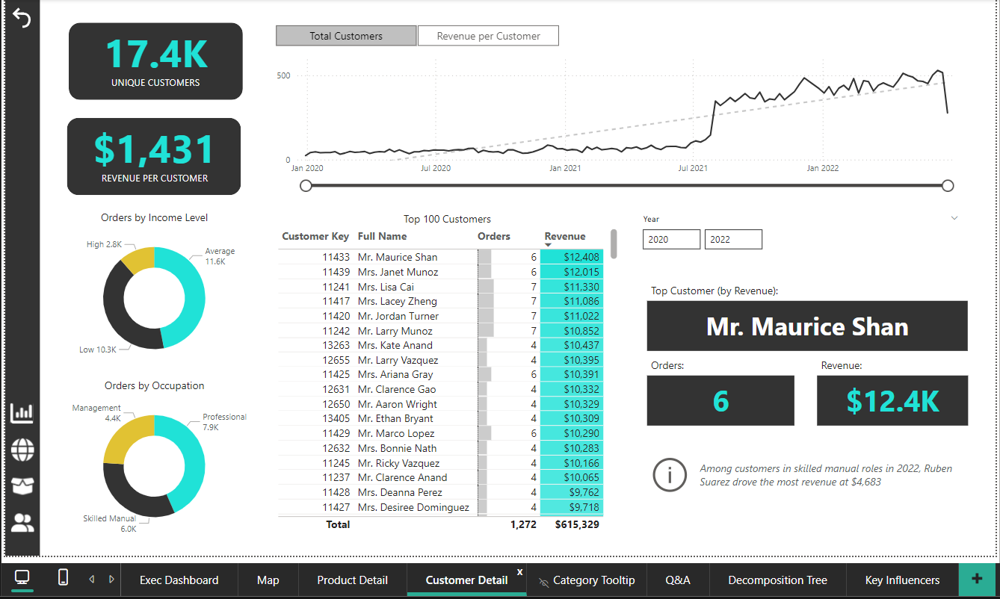
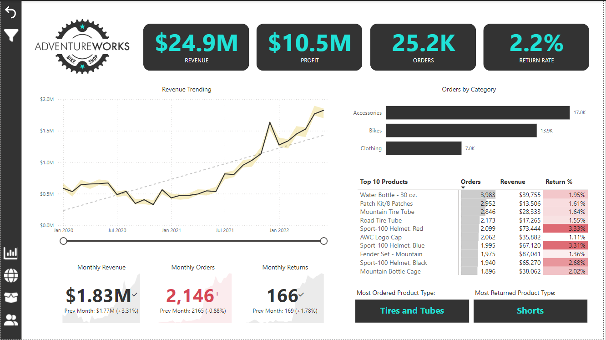
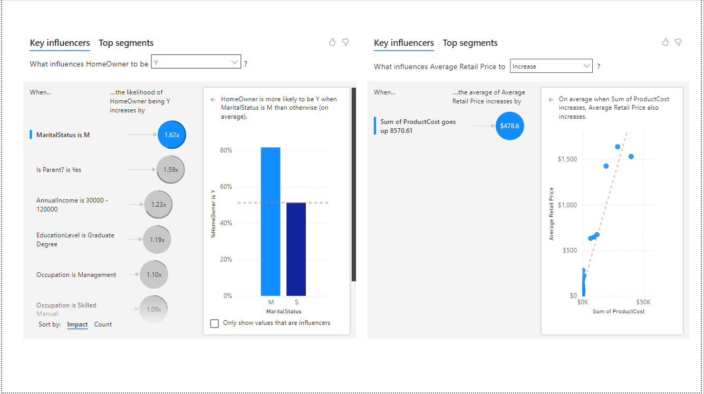
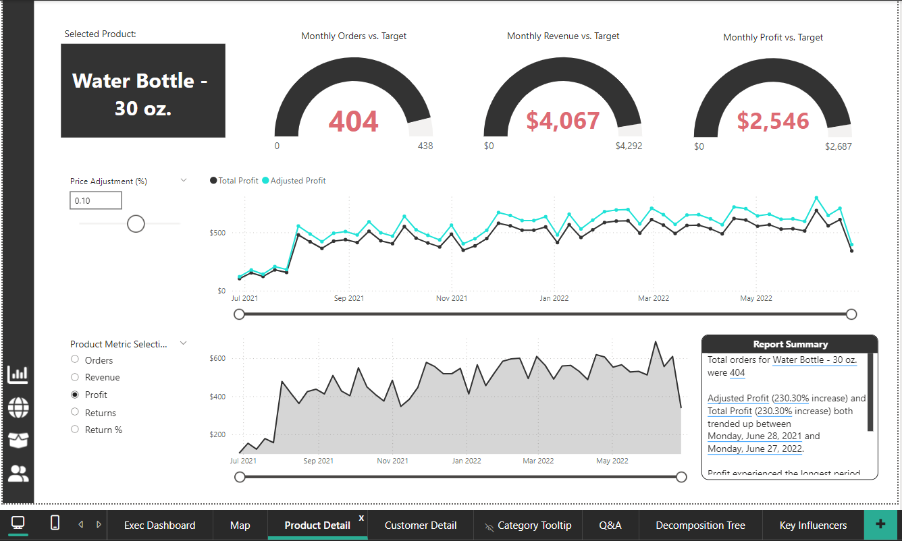
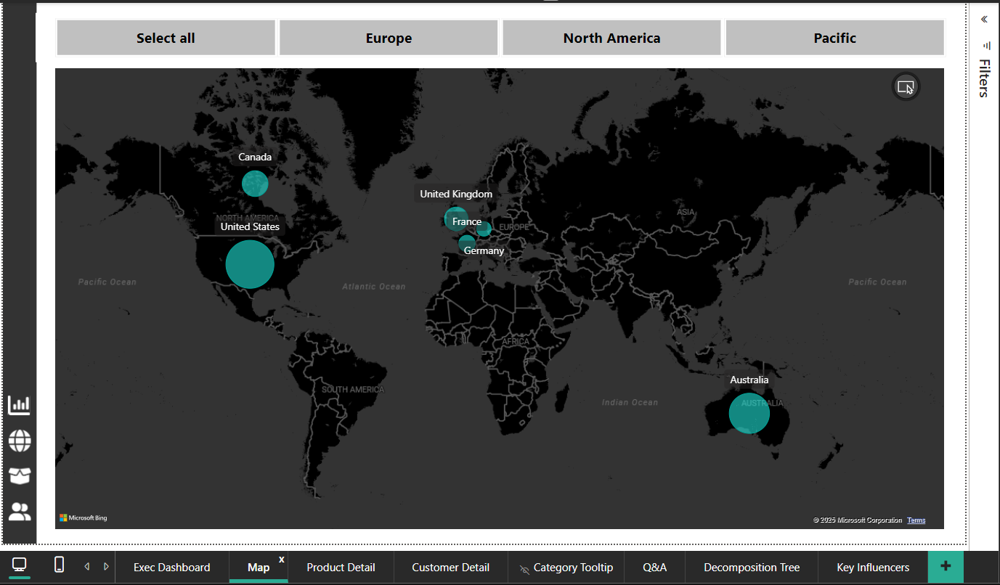

# **Power BI Business Intelligence Project: Comprehensive Analysis** 📊

---

[Download Power BI Raw file for the Project](https://github.com/Aravind-uk96/portfolio.github.io/raw/main/projects/adventureworks_reports1.pbix)

---

## **Introduction** ✨

This project highlights the application of Power BI to transform raw datasets into meaningful, interactive visualizations and actionable business insights. The goal was to demonstrate the full capabilities of Power BI in data preparation, modeling, and dashboard design, providing a robust tool for data-driven decision-making.

---

## **Objective** 🎯

The project aimed to:
- 🛠️ Build a comprehensive, interactive dashboard for business performance monitoring.
- 📈 Identify key trends, patterns, and actionable insights to drive strategic decisions.
- 💡 Empower stakeholders with real-time analytics and self-service reporting capabilities.

The focus was on creating an end-to-end BI solution that includes data connection, transformation, modeling, visualization, and optimization.

---

## **Project Workflow** 🚀

### **1. Data Connection and Import** 🔗
- Connected to multiple raw data sources in CSV and Excel formats.
- Utilized Power BI's **Power Query Editor** to load data seamlessly.
- Reviewed and documented the schema and metadata for all input data.

### **2. Data Transformation** 🔄
- **Data Cleaning**:
  - 🧹 Removed duplicates and null values.
  - 🏷️ Standardized column names and ensured consistency in formats (e.g., dates, currencies).
- **Data Merging and Shaping**:
  - 🔗 Merged datasets to integrate multiple sources into a unified view.
  - ✏️ Created custom columns for derived metrics such as profitability and growth rates.
- **Data Profiling**:
  - 🔍 Analyzed column distributions to identify potential outliers or anomalies.
  - ✅ Ensured data formatting and readiness for modeling.

### **3. Data Modeling** 🗂️
- **Schema Design**:
  - 🛠️ Designed a relational star schema with:
    - Fact table: Metrics like revenue, cost, and orders.
    - Dimension tables: Attributes such as products, customers, regions, and dates.
- **Relationships**:
  - 🤝 Established primary and foreign key relationships with correct cardinality.
  - 🔄 Enabled bidirectional filtering where required for detailed analysis.
- **Hierarchy Development**:
  - 📂 Built hierarchies for drill-down functionality (e.g., Year > Quarter > Month).

### **4. KPI Development** 📐
- Modeled key business metrics using **Data Analysis Expressions (DAX)**:
  - **📊 Total Revenue**: Aggregating revenue across transactions.
  - **💸 Profit Margin**: `(Revenue - Cost) / Revenue`.
  - **🔁 Customer Retention Rate**: Percentage of returning customers.
  - **📉 Order Conversion Rate**: Sessions-to-order ratio.
  - **📆 Year-over-Year Growth**: Comparing metrics over time periods.
- Developed calculated columns for:
  - 👥 Customer segmentation based on lifetime value.
  - 🎯 Product performance categorization (e.g., high-performing vs. low-performing).

### **5. Dashboard Design** 🎨
- **Dashboard Layout**:
  - 🖥️ Designed a clean and intuitive interface with separate sections for:
    - Sales performance.
    - Customer insights.
    - Product analysis.
    - Regional trends.
- **Visualizations**:
  - 📊 Bar and column charts for comparisons.
  - 📈 Line charts for trend analysis.
  - 🌍 Heatmaps for geographic insights.
  - 🎯 KPI cards for quick summaries of revenue, profit, and growth metrics.
- **Interactivity**:
  - 🎛️ Enabled slicers and filters for dynamic analysis.
  - 🔍 Incorporated drill-through pages for detailed data views.
  - 📑 Added bookmarks for toggling between dashboard sections.

### **6. Performance Optimization** ⚡
- 🗃️ Streamlined the data model by removing unnecessary columns.
- 🔄 Configured incremental data refresh to maintain up-to-date insights.
- 🚀 Minimized dataset size for improved report responsiveness.

---

## **Key KPIs Modeled** 📋
The project emphasized the following KPIs:
1. **📊 Total Revenue**: Overall business income.
2. **💸 Profit Margin**: Indicator of business profitability.
3. **🔁 Customer Retention Rate**: Percentage of returning customers.
4. **📈 Sales Growth**: Revenue growth trends over time.
5. **📉 Order Conversion Rate**: Sessions converting to orders.
6. **🌍 Regional Performance**: Sales and profit comparisons across regions.
7. **🎯 Product Profitability**: Performance categorization of products.

---

## **Tools and Technologies** 🛠️
- **Power BI Desktop**: For data connection, transformation, modeling, and visualization.
- **Power Query Editor**: For data preparation and transformation.
- **DAX (Data Analysis Expressions)**: For advanced calculations and measures.

---

## **Deliverables** 📦
1. **Interactive Dashboard**:
   - 🖥️ Consolidated views of sales, customer, product, and regional performance.
   - 🎛️ Dynamic visuals and interactivity for exploring trends and insights.
2. **Documentation**:
   - 📄 A detailed explanation of data preparation, modeling, and visualization processes.
3. **Presentation**:
   - 🖼️ A high-level summary of insights and recommendations for stakeholders.

---

# 📊 Dashboard Analysis

A comprehensive review of the six dashboards created, designed to provide actionable insights for stakeholders.

---

## 1️⃣ **Customer Detail Dashboard**

### 🎯 **Objective**  
Understand individual customer contributions, demographics, and behavioral trends for targeted insights.

### 📈 **Features & Insights**  
- **Top KPIs**:  
  - Unique Customers: Total number of distinct customers.  
  - Revenue Per Customer: Average revenue contribution per customer.
- **Visualizations**:  
  - **Pie Charts**: Customer segmentation by income levels and occupations.  
  - **Top 100 Customers Table**: Showcasing orders, revenue, and customer metrics.  
  - **Line Chart**: Trends showing growth in customers and revenue over time.
- **Filters**:  
  - Yearly filters (2020–2022) for customized analysis.  
  - Drill-through functionality to explore individual customer data.

### 🌟 **Significance**  
- Identifies high-value customers for personalized campaigns.  
- Enables segmentation for tailored business strategies.

---

## 2️⃣ **Executive Dashboard**

### 🎯 **Objective**  
Deliver a high-level overview of business performance for stakeholders, focusing on revenue, profitability, and returns.

### 📈 **Features & Insights**  
- **Top KPIs**:  
  - Total Revenue, Total Profit, Number of Orders, Return Rate.
- **Visualizations**:  
  - **Revenue Trend**: Line chart showcasing revenue growth over time.  
  - **Bar Chart**: Orders segmented by product categories (Accessories, Bikes, Clothing).  
  - **Table**: Top 10 products by revenue, orders, and return percentage.
- **Filters**:  
  - Time-based filters for trend analysis.  
  - Product category filters for detailed exploration.
- **Highlights**:  
  - Identifies products with high return percentages for immediate action.

### 🌟 **Significance**  
- Equips stakeholders with clear performance metrics.  
- Highlights revenue-driving products and problem areas for optimization.

---

## 3️⃣ **Key Influencers Dashboard**

### 🎯 **Objective**  
Identify the key factors influencing customer behavior and pricing strategies.

### 📈 **Features & Insights**  
- **Key Influencers**:  
  - Factors like Marital Status, Parental Status, Income Levels, and Occupation driving homeowner trends.  
  - Product Costs influencing Average Retail Prices.
- **Visualizations**:  
  - **Waterfall Visuals**: Quantifies the impact of each influencing factor.  
  - **Scatter Plot**: Relationship between product costs and retail pricing.
- **Segmentation**:  
  - Top customer segments identified based on influential factors.

### 🌟 **Significance**  
- Enables targeted decision-making by uncovering key drivers.  
- Supports tailored marketing and pricing strategies.

---

## 4️⃣ **Product Details Dashboard**

### 🎯 **Objective**  
Analyze product performance to identify key sales drivers, profitability, and return trends.

### 📈 **Features & Insights**  
- **Top KPIs**:  
  - Revenue, Orders, Profit, and Return Percentage.
- **Visualizations**:  
  - Product-specific performance metrics and trends.  
  - Distribution charts to analyze variability across products.
- **Highlights**:  
  - Most ordered and most returned product categories for optimization insights.

### 🌟 **Significance**  
- Delivers granular insights for improving product strategies.  
- Helps streamline inventory and reduce return rates.

---

## 5️⃣ **Q&A and AI-Driven Insights Dashboard**

### 🎯 **Objective**  
Empower users with interactive Q&A capabilities powered by AI for instant, tailored insights.

### 📈 **Features & Insights**  
- **Interactive Questions**:  
  - Examples:  
    - "What is the highest revenue category?"  
    - "Which product has the highest return rate?"  
- **Real-Time Filters**:  
  - Enables users to refine insights dynamically.  
- **Highlights**:  
  - AI-powered responses simplify data exploration without complex navigation.

### 🌟 **Significance**  
- Enhances user experience by providing intuitive, AI-driven interaction.  
- Accelerates decision-making with natural language queries.

---

## 6️⃣ **Decomposition Tree Dashboard**

### 🎯 **Objective**  
Break down hierarchical data to uncover underlying trends and relationships.

### 📈 **Features & Insights**  
- **Tree Structure**:  
  - Visualizes contributions of factors like Region, Product Type, and Customer Segments to metrics such as Revenue and Profit.
- **Drill-Down Analysis**:  
  - Explores data hierarchies to identify root causes of trends.
- **Highlights**:  
  - Pinpoints key drivers of business outcomes with ease.

### 🌟 **Significance**  
- Ideal for root cause analysis and hierarchical data exploration.  
- Reveals intricate relationships between business dimensions.

---

## 7️⃣ **Bubble Map: Order Distribution Across Countries**

### 🎯 **Objective**  
Visualize global order distribution with an interactive, geographic perspective to identify key markets and trends.  

### 📈 **Features & Insights**  

- **Data Representation**:  
  - The map overlays countries with bubbles.  
  - **Bubble Size**: Reflects total orders from each country (larger bubbles = more orders).  

- **Interactive Filters**:  
  - **"Select All"**: View global distribution.  
  - **"Europe"**: Focus on European countries.  
  - **"North America"**: Isolate North American data.  
  - **"Pacific"**: Highlight Pacific region orders.  

- **Key Insights**:  
  - **United States**: Largest bubble, indicating the highest order volume.  
  - **Canada**: Smaller bubble, showcasing lower order volume compared to the U.S.  
  - **Europe**: Varying bubble sizes in countries like the UK, France, and Germany, reflecting different order levels.

### 🌟 **Significance**  

- **Clarity**: Provides a quick and intuitive overview of geographic order distribution.  
- **Actionable Insights**: Identifies key markets for resource allocation and strategy development.  
- **Enhanced Decision-Making**: Facilitates regional performance comparisons to inform marketing and sales initiatives.

---

## 📌 **Conclusion**

These dashboards form a robust suite of business intelligence tools, offering:  
- Strategic insights through high-level metrics.  
- Granular analysis for targeted improvements.  
- AI-driven interactivity for ease of use.  

Together, they empower stakeholders to make data-driven decisions with confidence and clarity.

